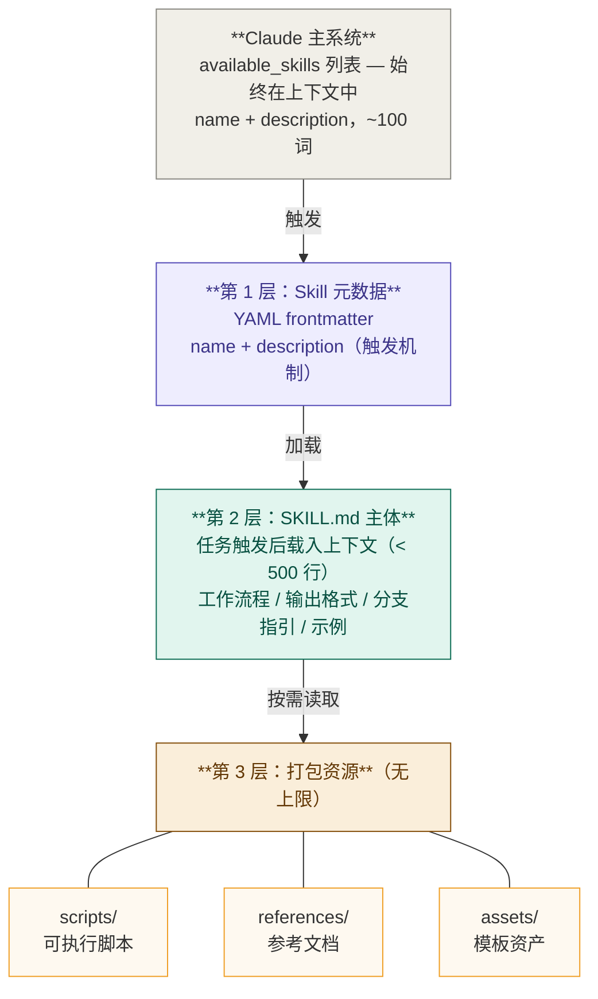
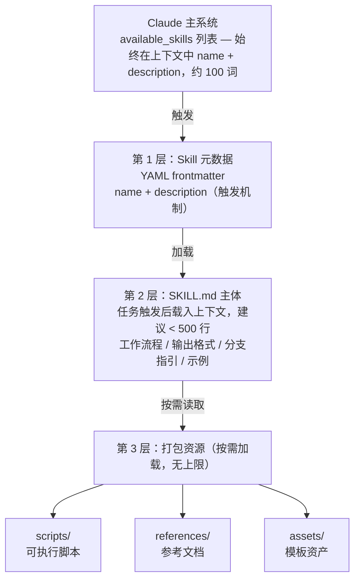
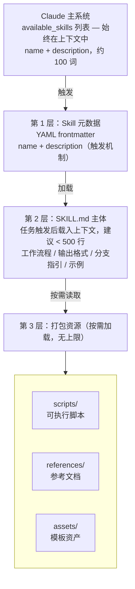

---
aliases:
tags:
description:
type:
ref-url:
---
## 内容

### 版本1 

```mermaid
flowchart TD
    A["**Claude 主系统**<br>available_skills 列表 — 始终在上下文中<br>name + description，~100 词"]

    A -->|触发| B

    B["**第 1 层：Skill 元数据**<br>YAML frontmatter<br>name + description（触发机制）"]

    B -->|加载| C

    C["**第 2 层：SKILL.md 主体**<br>任务触发后载入上下文（&lt; 500 行）<br>工作流程 / 输出格式 / 分支指引 / 示例"]

    C -->|按需读取| D

    D["**第 3 层：打包资源**（无上限）"]

    D --- D1["scripts/<br>可执行脚本"]
    D --- D2["references/<br>参考文档"]
    D --- D3["assets/<br>模板资产"]

    style A fill:#F1EFE8,stroke:#888780
    style B fill:#EEEDFE,stroke:#534AB7,color:#3C3489
    style C fill:#E1F5EE,stroke:#0F6E56,color:#085041
    style D fill:#FAEEDA,stroke:#854F0B,color:#633806
    style D1 fill:#FEF9F0,stroke:#EF9F27
    style D2 fill:#FEF9F0,stroke:#EF9F27
    style D3 fill:#FEF9F0,stroke:#EF9F27
```

### 版本2

```mermaid
flowchart TD
    A["Claude 主系统<br/>available_skills 列表 — 始终在上下文中 name + description，约 100 词"]
    B["第 1 层：Skill 元数据<br>YAML frontmatter<br>name + description（触发机制）"]
    C["第 2 层：SKILL.md 主体<br>任务触发后载入上下文，建议 < 500 行<br>工作流程 / 输出格式 / 分支指引 / 示例"]
    D["第 3 层：打包资源（按需加载，无上限）"]
    D1["scripts/<br>可执行脚本"]
    D2["references/<br>参考文档"]
    D3["assets/<br>模板资产"]

    A -->|触发| B
    B -->|加载| C
    C -->|按需读取| D
    D --> D1 & D2 & D3
```

### 版本3

``` mermaid
flowchart TD
    A["Claude 主系统<br/>available_skills 列表 — 始终在上下文中<br/>name + description，约 100 词"]
    B["第 1 层：Skill 元数据<br/>YAML frontmatter<br/>name + description（触发机制）"]
    C["第 2 层：SKILL.md 主体<br/>任务触发后载入上下文，建议 &lt; 500 行<br/>工作流程 / 输出格式 / 分支指引 / 示例"]
    D["第 3 层：打包资源（按需加载，无上限）"]

    A -->|触发| B
    B -->|加载| C
    C -->|按需读取| D

    subgraph resources[" "]
        direction LR
        D1["scripts/<br/>可执行脚本"]
        D2["references/<br/>参考文档"]
        D3["assets/<br/>模板资产"]
    end

    D --> resources
```
