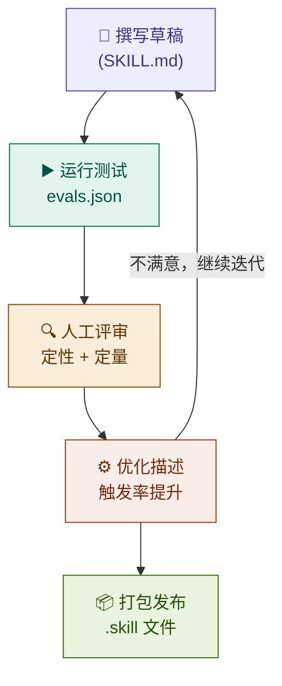

---
aliases:
tags:
description:
type:
ref-url:
create-date: 2026-03-21
---
## 一、整体架构概览

- [[SKILL-架构图]]
![[38f124a0f0273630a9e3f146c32ca654_MD5.jpg]]
## 二、核心设计理念

### 1. 渐进式披露（Progressive Disclosure）

这是整个 Skill 系统最核心的架构原则。系统把知识分成三层，按需加载，避免一次性塞满上下文：

**第 1 层**（始终在上下文）：只有 `name` + `description`，约 100 词，用于让 Claude 判断是否需要触发某个 Skill。**第 2 层**（触发后加载）：完整的 `SKILL.md` 主体，包含工作流程、格式规范、示例，建议保持在 500 行以内。**第 3 层**（按需读取）：脚本、参考文档、模板等打包资源，内容无上限，Claude 在需要时才去读取，甚至可以直接执行而不加载到上下文。

### 2. Description 即触发器（Description as Trigger）

`description` 字段承担双重职责——既说明 Skill 做什么，也说明何时应该用它。这个字段是 Claude 做决策的唯一依据，因此写法要"主动"，避免过于保守导致触发不足（under-trigger）。设计规范明确要求描述要带一点"推动感"，让 Claude 在边界情况下也倾向于启用该 Skill。

### 3. 关注点分离（Separation of Concerns）

Skill 文件夹里三类资源各司其职：`scripts/` 处理确定性、重复性的计算任务（如打包、格式转换）；`references/` 存放大型文档（如 API 规范），需要时才读入上下文；`assets/` 存放模板、字体、图标等输出物料。这样 SKILL.md 保持精简，复杂细节下沉到各自的资源文件。

### 4. 惊喜最小化原则（Principle of Least Surprise）

Skill 的行为必须与其描述完全一致，不应产生用户没有预期的副作用。这是一条安全原则，也是可维护性原则——当行为可预测时，测试和迭代才有意义。

### 5. 可测试、可迭代的闭环（Eval-Driven Iteration Loop）
![[fdd0b5ad0b2145c0cc901d8e0c0c4fe8_MD5.jpg]]

Skill 的开发不是一次性写完就结束，而是一个明确的迭代闭环：Skill 的质量有明确的量化指标：**触发率**（触发时该用、不该用时不触发），通过自动化脚本 `run_loop.py` 在 train/test 集上迭代优化 description，防止过拟合。

### 6. 面向真实任务设计（Task-Oriented, Not Feature-Oriented）

Skill 的测试用例必须是"用户真实会说的话"，而不是"功能点的枚举"。简单的一步骤查询不应该触发 Skill，只有真正需要多步骤、专业化处理的复杂请求才应该触发。这保证了 Skill 系统的价值——它用于放大 Claude 在复杂领域的能力，而不是包装简单操作。

### 7. 路由即责任（Routing as Responsibility）

每个 Skill 都应该知道自己的边界。`file-reading` Skill 是一个典型例子：它本身只做"正确的第一步"判断和派发，当遇到需要深度处理的场景时，明确地将控制权路由给更专业的 `pdf-reading`、`docx`、`xlsx` 等技能。这形成了一个清晰的**责任链**，避免单个 Skill 过度膨胀。

---

## 三、设计哲学总结

Skills 系统的本质是**将 Claude 的能力外化为可组合、可测试、可演化的知识单元**。它不是插件，也不是 API，而是一套结构化的"专家经验提炼"机制——把人类通过反复试验积累的最佳实践，以 Claude 可以直接阅读和执行的形式持久化下来，并通过渐进披露保证运行时效率，通过评测闭环保证持续质量。

