---
aliases:
tags:
description:
type:
ref-url:
create-date: 2026-04-23 12:39
---
# UML 全量扫描（PlantUML）

  

> 由脚本扫描当前仓库 Java 源码生成。范围：所有 `.java` 文件，排除 `bin`、`test`、`testSrc`。

>

> 使用方式：在 Obsidian 中打开本文件；也可以打开 `uml-plantuml-scan/` 下的 `.puml` 文件查看单个模块或 package。

  

## 扫描摘要

  

- Java 源文件：2022

- 类型总数：2166

- class：1442

- interface：694

- enum：30

- 继承关系：832

- 实现关系：427

- 字段依赖关系：1344

  

## 全局图

  

- [模块依赖图](00-module-dependencies.puml)

- [全量继承/实现图](01-all-inheritance-implements.puml)

```plantuml

@startuml

left to right direction

skinparam classAttributeIconSize 0

title Module Dependency Overview

  

component "cn.haolab.problem.fjsp.model\n134 types" as M_cn_haolab_problem_fjsp_model

component "com.evolsoft.bayesian\n26 types" as M_com_evolsoft_bayesian

component "com.evolsoft.core\n367 types" as M_com_evolsoft_core

component "com.evolsoft.ec.chart\n25 types" as M_com_evolsoft_ec_chart

component "com.evolsoft.ec.diagram\n13 types" as M_com_evolsoft_ec_diagram

component "com.evolsoft.ec.eda\n6 types" as M_com_evolsoft_ec_eda

component "com.evolsoft.ec.ga.tool\n21 types" as M_com_evolsoft_ec_ga_tool

component "com.evolsoft.ec.msga.tool\n17 types" as M_com_evolsoft_ec_msga_tool

component "com.evolsoft.ec.pbil\n61 types" as M_com_evolsoft_ec_pbil

component "com.evolsoft.ec.pbil.testSuite\n11 types" as M_com_evolsoft_ec_pbil_testSuite

component "com.evolsoft.ec.problem.rcpsp\n51 types" as M_com_evolsoft_ec_problem_rcpsp

component "com.evolsoft.ec.problem.rcpsp.individualService\n22 types" as M_com_evolsoft_ec_problem_rcpsp_individualService

component "com.evolsoft.ec.problem.rcpsp.template\n1 types" as M_com_evolsoft_ec_problem_rcpsp_template

component "com.evolsoft.ec.pso\n29 types" as M_com_evolsoft_ec_pso

component "com.evolsoft.ec.resource\n5 types" as M_com_evolsoft_ec_resource

component "com.evolsoft.ec.runtime\n777 types" as M_com_evolsoft_ec_runtime

component "com.evolsoft.ec.sa\n28 types" as M_com_evolsoft_ec_sa

component "com.evolsoft.ec.tool.mail\n3 types" as M_com_evolsoft_ec_tool_mail

component "com.evolsoft.ec.toolbox.GanttChart\n68 types" as M_com_evolsoft_ec_toolbox_GanttChart

component "com.evolsoft.ec.toolbox.mrf\n27 types" as M_com_evolsoft_ec_toolbox_mrf

component "com.evolsoft.ec.toolbox.notation\n23 types" as M_com_evolsoft_ec_toolbox_notation

component "com.evolsoft.ec.toolbox.policyTree\n25 types" as M_com_evolsoft_ec_toolbox_policyTree

component "com.evolsoft.ec.toolbox.styles\n12 types" as M_com_evolsoft_ec_toolbox_styles

component "com.evolsoft.ec.ui\n100 types" as M_com_evolsoft_ec_ui

component "com.evolsoft.ec.ui.EditorEx\n4 types" as M_com_evolsoft_ec_ui_EditorEx

component "com.evolsoft.ec.ui.control\n8 types" as M_com_evolsoft_ec_ui_control

component "com.evolsoft.ec.ui.simulation\n25 types" as M_com_evolsoft_ec_ui_simulation

component "com.evolsoft.ec.uiExtension\n19 types" as M_com_evolsoft_ec_uiExtension

component "com.evolsoft.fjsp2.individualServiceBase\n23 types" as M_com_evolsoft_fjsp2_individualServiceBase

component "com.evolsoft.problem.fjsp2.adapter\n30 types" as M_com_evolsoft_problem_fjsp2_adapter

component "com.evolsoft.problem.fjsp2.adaptrerBase\n18 types" as M_com_evolsoft_problem_fjsp2_adaptrerBase

component "com.evolsoft.problem.fjsp2.ecTemplate\n1 types" as M_com_evolsoft_problem_fjsp2_ecTemplate

component "com.evolsoft.problem.fjsp2.individualService\n19 types" as M_com_evolsoft_problem_fjsp2_individualService

component "com.evolsoft.problem.fjsp2.model\n139 types" as M_com_evolsoft_problem_fjsp2_model

component "com.evolsoft.problem.fjsp2.psoInvidualService\n8 types" as M_com_evolsoft_problem_fjsp2_psoInvidualService

component "com.evosoft.assmnt\n13 types" as M_com_evosoft_assmnt

component "ec.evolsoft.ec.solutionViewer\n5 types" as M_ec_evolsoft_ec_solutionViewer

component "org.jfreechart_v1_0_13\n1 types" as M_org_jfreechart_v1_0_13

component "xstream_v1_3_1\n1 types" as M_xstream_v1_3_1

  

M_com_evolsoft_ec_runtime ..> M_com_evolsoft_core : 241

M_com_evolsoft_ec_ui ..> M_com_evolsoft_ec_runtime : 44

M_com_evolsoft_ec_ga_tool ..> M_com_evolsoft_ec_runtime : 20

M_com_evolsoft_ec_msga_tool ..> M_com_evolsoft_ec_runtime : 20

M_com_evolsoft_ec_problem_rcpsp ..> M_com_evolsoft_core : 20

M_com_evolsoft_ec_pbil ..> M_com_evolsoft_ec_runtime : 19

M_com_evolsoft_problem_fjsp2_individualService ..> M_com_evolsoft_fjsp2_individualServiceBase : 19

M_com_evolsoft_problem_fjsp2_adapter ..> M_com_evolsoft_ec_runtime : 18

M_com_evolsoft_ec_problem_rcpsp_individualService ..> M_com_evolsoft_ec_runtime : 17

M_com_evolsoft_ec_ui ..> M_com_evolsoft_core : 17

M_com_evolsoft_problem_fjsp2_adaptrerBase ..> M_com_evolsoft_ec_runtime : 17

M_com_evolsoft_ec_problem_rcpsp_individualService ..> M_com_evolsoft_ec_problem_rcpsp : 16

M_com_evolsoft_ec_pso ..> M_com_evolsoft_ec_runtime : 15

M_com_evolsoft_problem_fjsp2_adapter ..> M_com_evolsoft_ec_toolbox_GanttChart : 13

M_com_evolsoft_problem_fjsp2_adaptrerBase ..> M_com_evolsoft_ec_toolbox_GanttChart : 13

M_com_evolsoft_ec_sa ..> M_com_evolsoft_ec_runtime : 12

M_com_evolsoft_ec_toolbox_mrf ..> M_com_evolsoft_core : 12

M_cn_haolab_problem_fjsp_model ..> M_com_evolsoft_core : 11

M_com_evolsoft_fjsp2_individualServiceBase ..> M_com_evolsoft_ec_runtime : 11

M_com_evolsoft_problem_fjsp2_psoInvidualService ..> M_com_evolsoft_ec_pso : 11

M_com_evolsoft_ec_problem_rcpsp_individualService ..> M_com_evolsoft_ec_pbil : 10

M_com_evolsoft_ec_toolbox_GanttChart ..> M_com_evolsoft_ec_runtime : 10

M_com_evolsoft_problem_fjsp2_model ..> M_com_evolsoft_core : 9

M_com_evolsoft_ec_eda ..> M_com_evolsoft_ec_runtime : 8

M_com_evolsoft_ec_msga_tool ..> M_com_evolsoft_core : 8

M_com_evolsoft_ec_toolbox_mrf ..> M_com_evolsoft_ec_runtime : 8

M_com_evolsoft_problem_fjsp2_adapter ..> M_com_evolsoft_core : 8

M_com_evolsoft_problem_fjsp2_individualService ..> M_com_evolsoft_ec_runtime : 8

M_com_evolsoft_ec_chart ..> M_com_evolsoft_core : 7

M_com_evolsoft_ec_pbil ..> M_com_evolsoft_ec_toolbox_styles : 7

M_com_evolsoft_ec_uiExtension ..> M_com_evolsoft_ec_runtime : 7

M_com_evolsoft_problem_fjsp2_psoInvidualService ..> M_com_evolsoft_ec_runtime : 7

M_com_evolsoft_ec_pbil_testSuite ..> M_com_evolsoft_ec_pbil : 6

M_com_evolsoft_ec_problem_rcpsp_individualService ..> M_com_evolsoft_fjsp2_individualServiceBase : 6

M_com_evolsoft_ec_problem_rcpsp_individualService ..> M_com_evolsoft_problem_fjsp2_model : 6

M_com_evolsoft_ec_pbil ..> M_com_evolsoft_ec_eda : 5

M_com_evolsoft_ec_problem_rcpsp ..> M_com_evolsoft_ec_runtime : 5

M_com_evolsoft_problem_fjsp2_individualService ..> M_com_evolsoft_ec_pbil : 5

M_com_evolsoft_problem_fjsp2_psoInvidualService ..> M_com_evolsoft_fjsp2_individualServiceBase : 5

M_com_evosoft_assmnt ..> M_com_evolsoft_ec_runtime : 5

M_com_evolsoft_ec_chart ..> M_com_evolsoft_ec_runtime : 4

M_com_evolsoft_ec_toolbox_GanttChart ..> M_com_evolsoft_ec_toolbox_styles : 4

M_com_evolsoft_fjsp2_individualServiceBase ..> M_com_evolsoft_ec_toolbox_GanttChart : 4

M_com_evosoft_assmnt ..> M_com_evolsoft_core : 4

M_com_evolsoft_bayesian ..> M_com_evolsoft_core : 3

M_com_evolsoft_ec_pbil ..> M_com_evolsoft_ec_ui_control : 3

M_com_evolsoft_ec_problem_rcpsp_individualService ..> M_com_evolsoft_core : 3

M_com_evolsoft_ec_toolbox_GanttChart ..> M_com_evolsoft_core : 3

M_com_evolsoft_ec_toolbox_policyTree ..> M_com_evolsoft_ec_toolbox_styles : 3

M_com_evolsoft_ec_ui_EditorEx ..> M_com_evolsoft_ec_toolbox_GanttChart : 3

M_com_evolsoft_fjsp2_individualServiceBase ..> M_com_evolsoft_ec_toolbox_mrf : 3

M_com_evolsoft_fjsp2_individualServiceBase ..> M_com_evolsoft_problem_fjsp2_model : 3

M_com_evolsoft_problem_fjsp2_individualService ..> M_com_evolsoft_core : 3

M_com_evolsoft_problem_fjsp2_individualService ..> M_com_evolsoft_ec_toolbox_mrf : 3

M_ec_evolsoft_ec_solutionViewer ..> M_com_evolsoft_core : 3

M_com_evolsoft_ec_pbil ..> M_com_evolsoft_ec_toolbox_notation : 2

M_com_evolsoft_ec_pbil_testSuite ..> M_com_evolsoft_ec_toolbox_styles : 2

M_com_evolsoft_ec_pbil_testSuite ..> M_com_evolsoft_ec_ui_control : 2

M_com_evolsoft_ec_problem_rcpsp ..> M_com_evolsoft_ec_toolbox_GanttChart : 2

M_com_evolsoft_ec_toolbox_policyTree ..> M_com_evolsoft_ec_toolbox_notation : 2

M_com_evolsoft_ec_uiExtension ..> M_com_evolsoft_ec_ui : 2

M_com_evolsoft_fjsp2_individualServiceBase ..> M_com_evolsoft_ec_pbil : 2

M_com_evolsoft_problem_fjsp2_adapter ..> M_com_evolsoft_problem_fjsp2_model : 2

M_com_evolsoft_problem_fjsp2_adaptrerBase ..> M_com_evolsoft_core : 2

M_com_evolsoft_problem_fjsp2_individualService ..> M_com_evolsoft_problem_fjsp2_adapter : 2

M_com_evolsoft_problem_fjsp2_individualService ..> M_com_evolsoft_problem_fjsp2_model : 2

M_com_evolsoft_problem_fjsp2_model ..> M_com_evolsoft_ec_runtime : 2

M_com_evolsoft_ec_pbil ..> M_com_evolsoft_core : 1

M_com_evolsoft_ec_pbil_testSuite ..> M_com_evolsoft_ec_runtime : 1

M_com_evolsoft_ec_problem_rcpsp ..> M_com_evolsoft_problem_fjsp2_model : 1

M_com_evolsoft_ec_toolbox_GanttChart ..> M_com_evolsoft_ec_ui_control : 1

M_com_evolsoft_problem_fjsp2_adaptrerBase ..> M_com_evolsoft_problem_fjsp2_adapter : 1

M_com_evolsoft_problem_fjsp2_individualService ..> M_com_evolsoft_problem_fjsp2_adaptrerBase : 1

@enduml

```

  

  

## 模块清单

  

| 模块 | 类型数 | PlantUML |

|---|---:|---|

| `com.evolsoft.ec.runtime` | 777 | [module-com.evolsoft.ec.runtime.puml](module-com.evolsoft.ec.runtime.puml) |

| `com.evolsoft.core` | 367 | [module-com.evolsoft.core.puml](module-com.evolsoft.core.puml) |

| `com.evolsoft.problem.fjsp2.model` | 139 | [module-com.evolsoft.problem.fjsp2.model.puml](module-com.evolsoft.problem.fjsp2.model.puml) |

| `cn.haolab.problem.fjsp.model` | 134 | [module-cn.haolab.problem.fjsp.model.puml](module-cn.haolab.problem.fjsp.model.puml) |

| `com.evolsoft.ec.ui` | 100 | [module-com.evolsoft.ec.ui.puml](module-com.evolsoft.ec.ui.puml) |

| `com.evolsoft.ec.toolbox.GanttChart` | 68 | [module-com.evolsoft.ec.toolbox.GanttChart.puml](module-com.evolsoft.ec.toolbox.GanttChart.puml) |

| `com.evolsoft.ec.pbil` | 61 | [module-com.evolsoft.ec.pbil.puml](module-com.evolsoft.ec.pbil.puml) |

| `com.evolsoft.ec.problem.rcpsp` | 51 | [module-com.evolsoft.ec.problem.rcpsp.puml](module-com.evolsoft.ec.problem.rcpsp.puml) |

| `com.evolsoft.problem.fjsp2.adapter` | 30 | [module-com.evolsoft.problem.fjsp2.adapter.puml](module-com.evolsoft.problem.fjsp2.adapter.puml) |

| `com.evolsoft.ec.pso` | 29 | [module-com.evolsoft.ec.pso.puml](module-com.evolsoft.ec.pso.puml) |

| `com.evolsoft.ec.sa` | 28 | [module-com.evolsoft.ec.sa.puml](module-com.evolsoft.ec.sa.puml) |

| `com.evolsoft.ec.toolbox.mrf` | 27 | [module-com.evolsoft.ec.toolbox.mrf.puml](module-com.evolsoft.ec.toolbox.mrf.puml) |

| `com.evolsoft.bayesian` | 26 | [module-com.evolsoft.bayesian.puml](module-com.evolsoft.bayesian.puml) |

| `com.evolsoft.ec.chart` | 25 | [module-com.evolsoft.ec.chart.puml](module-com.evolsoft.ec.chart.puml) |

| `com.evolsoft.ec.toolbox.policyTree` | 25 | [module-com.evolsoft.ec.toolbox.policyTree.puml](module-com.evolsoft.ec.toolbox.policyTree.puml) |

| `com.evolsoft.ec.ui.simulation` | 25 | [module-com.evolsoft.ec.ui.simulation.puml](module-com.evolsoft.ec.ui.simulation.puml) |

| `com.evolsoft.ec.toolbox.notation` | 23 | [module-com.evolsoft.ec.toolbox.notation.puml](module-com.evolsoft.ec.toolbox.notation.puml) |

| `com.evolsoft.fjsp2.individualServiceBase` | 23 | [module-com.evolsoft.fjsp2.individualServiceBase.puml](module-com.evolsoft.fjsp2.individualServiceBase.puml) |

| `com.evolsoft.ec.problem.rcpsp.individualService` | 22 | [module-com.evolsoft.ec.problem.rcpsp.individualService.puml](module-com.evolsoft.ec.problem.rcpsp.individualService.puml) |

| `com.evolsoft.ec.ga.tool` | 21 | [module-com.evolsoft.ec.ga.tool.puml](module-com.evolsoft.ec.ga.tool.puml) |

| `com.evolsoft.ec.uiExtension` | 19 | [module-com.evolsoft.ec.uiExtension.puml](module-com.evolsoft.ec.uiExtension.puml) |

| `com.evolsoft.problem.fjsp2.individualService` | 19 | [module-com.evolsoft.problem.fjsp2.individualService.puml](module-com.evolsoft.problem.fjsp2.individualService.puml) |

| `com.evolsoft.problem.fjsp2.adaptrerBase` | 18 | [module-com.evolsoft.problem.fjsp2.adaptrerBase.puml](module-com.evolsoft.problem.fjsp2.adaptrerBase.puml) |

| `com.evolsoft.ec.msga.tool` | 17 | [module-com.evolsoft.ec.msga.tool.puml](module-com.evolsoft.ec.msga.tool.puml) |

| `com.evolsoft.ec.diagram` | 13 | [module-com.evolsoft.ec.diagram.puml](module-com.evolsoft.ec.diagram.puml) |

| `com.evosoft.assmnt` | 13 | [module-com.evosoft.assmnt.puml](module-com.evosoft.assmnt.puml) |

| `com.evolsoft.ec.toolbox.styles` | 12 | [module-com.evolsoft.ec.toolbox.styles.puml](module-com.evolsoft.ec.toolbox.styles.puml) |

| `com.evolsoft.ec.pbil.testSuite` | 11 | [module-com.evolsoft.ec.pbil.testSuite.puml](module-com.evolsoft.ec.pbil.testSuite.puml) |

| `com.evolsoft.ec.ui.control` | 8 | [module-com.evolsoft.ec.ui.control.puml](module-com.evolsoft.ec.ui.control.puml) |

| `com.evolsoft.problem.fjsp2.psoInvidualService` | 8 | [module-com.evolsoft.problem.fjsp2.psoInvidualService.puml](module-com.evolsoft.problem.fjsp2.psoInvidualService.puml) |

| `com.evolsoft.ec.eda` | 6 | [module-com.evolsoft.ec.eda.puml](module-com.evolsoft.ec.eda.puml) |

| `com.evolsoft.ec.resource` | 5 | [module-com.evolsoft.ec.resource.puml](module-com.evolsoft.ec.resource.puml) |

| `ec.evolsoft.ec.solutionViewer` | 5 | [module-ec.evolsoft.ec.solutionViewer.puml](module-ec.evolsoft.ec.solutionViewer.puml) |

| `com.evolsoft.ec.ui.EditorEx` | 4 | [module-com.evolsoft.ec.ui.EditorEx.puml](module-com.evolsoft.ec.ui.EditorEx.puml) |

| `com.evolsoft.ec.tool.mail` | 3 | [module-com.evolsoft.ec.tool.mail.puml](module-com.evolsoft.ec.tool.mail.puml) |

| `com.evolsoft.ec.problem.rcpsp.template` | 1 | [module-com.evolsoft.ec.problem.rcpsp.template.puml](module-com.evolsoft.ec.problem.rcpsp.template.puml) |

| `com.evolsoft.problem.fjsp2.ecTemplate` | 1 | [module-com.evolsoft.problem.fjsp2.ecTemplate.puml](module-com.evolsoft.problem.fjsp2.ecTemplate.puml) |

| `org.jfreechart_v1_0_13` | 1 | [module-org.jfreechart_v1_0_13.puml](module-org.jfreechart_v1_0_13.puml) |

| `xstream_v1_3_1` | 1 | [module-xstream_v1_3_1.puml](module-xstream_v1_3_1.puml) |

  

## Package 清单

  

| Package | 类型数 | PlantUML |

|---|---:|---|

| `com.evolsoft.assmnt` | 1 | [package-com.evolsoft.assmnt.puml](package-com.evolsoft.assmnt.puml) |

| `com.evolsoft.assmnt.model` | 4 | [package-com.evolsoft.assmnt.model.puml](package-com.evolsoft.assmnt.model.puml) |

| `com.evolsoft.assmnt.problem` | 4 | [package-com.evolsoft.assmnt.problem.puml](package-com.evolsoft.assmnt.problem.puml) |

| `com.evolsoft.bayesian` | 21 | [package-com.evolsoft.bayesian.puml](package-com.evolsoft.bayesian.puml) |

| `com.evolsoft.bayesian.cost` | 5 | [package-com.evolsoft.bayesian.cost.puml](package-com.evolsoft.bayesian.cost.puml) |

| `com.evolsoft.core` | 6 | [package-com.evolsoft.core.puml](package-com.evolsoft.core.puml) |

| `com.evolsoft.core.configuration` | 15 | [package-com.evolsoft.core.configuration.puml](package-com.evolsoft.core.configuration.puml) |

| `com.evolsoft.core.configuration.annotation` | 3 | [package-com.evolsoft.core.configuration.annotation.puml](package-com.evolsoft.core.configuration.annotation.puml) |

| `com.evolsoft.core.configuration.apporach` | 8 | [package-com.evolsoft.core.configuration.apporach.puml](package-com.evolsoft.core.configuration.apporach.puml) |

| `com.evolsoft.core.configuration.impl` | 11 | [package-com.evolsoft.core.configuration.impl.puml](package-com.evolsoft.core.configuration.impl.puml) |

| `com.evolsoft.core.configuration.metadata` | 7 | [package-com.evolsoft.core.configuration.metadata.puml](package-com.evolsoft.core.configuration.metadata.puml) |

| `com.evolsoft.core.configuration.metadata.impl` | 8 | [package-com.evolsoft.core.configuration.metadata.impl.puml](package-com.evolsoft.core.configuration.metadata.impl.puml) |

| `com.evolsoft.core.configuration.metadata.util` | 3 | [package-com.evolsoft.core.configuration.metadata.util.puml](package-com.evolsoft.core.configuration.metadata.util.puml) |

| `com.evolsoft.core.configuration.misc` | 5 | [package-com.evolsoft.core.configuration.misc.puml](package-com.evolsoft.core.configuration.misc.puml) |

| `com.evolsoft.core.configuration.problem` | 12 | [package-com.evolsoft.core.configuration.problem.puml](package-com.evolsoft.core.configuration.problem.puml) |

| `com.evolsoft.core.configuration.util` | 2 | [package-com.evolsoft.core.configuration.util.puml](package-com.evolsoft.core.configuration.util.puml) |

| `com.evolsoft.core.configuration.variables` | 7 | [package-com.evolsoft.core.configuration.variables.puml](package-com.evolsoft.core.configuration.variables.puml) |

| `com.evolsoft.core.exceptions` | 2 | [package-com.evolsoft.core.exceptions.puml](package-com.evolsoft.core.exceptions.puml) |

| `com.evolsoft.core.experiment` | 4 | [package-com.evolsoft.core.experiment.puml](package-com.evolsoft.core.experiment.puml) |

| `com.evolsoft.core.log` | 10 | [package-com.evolsoft.core.log.puml](package-com.evolsoft.core.log.puml) |

| `com.evolsoft.core.plugin` | 2 | [package-com.evolsoft.core.plugin.puml](package-com.evolsoft.core.plugin.puml) |

| `com.evolsoft.core.preferences` | 3 | [package-com.evolsoft.core.preferences.puml](package-com.evolsoft.core.preferences.puml) |

| `com.evolsoft.core.runtime` | 29 | [package-com.evolsoft.core.runtime.puml](package-com.evolsoft.core.runtime.puml) |

| `com.evolsoft.core.runtime.impl` | 11 | [package-com.evolsoft.core.runtime.impl.puml](package-com.evolsoft.core.runtime.impl.puml) |

| `com.evolsoft.core.runtime.monitor` | 8 | [package-com.evolsoft.core.runtime.monitor.puml](package-com.evolsoft.core.runtime.monitor.puml) |

| `com.evolsoft.core.runtime.monitor.impl` | 6 | [package-com.evolsoft.core.runtime.monitor.impl.puml](package-com.evolsoft.core.runtime.monitor.impl.puml) |

| `com.evolsoft.core.runtime.monitor.util` | 4 | [package-com.evolsoft.core.runtime.monitor.util.puml](package-com.evolsoft.core.runtime.monitor.util.puml) |

| `com.evolsoft.core.runtime.problem` | 34 | [package-com.evolsoft.core.runtime.problem.puml](package-com.evolsoft.core.runtime.problem.puml) |

| `com.evolsoft.core.runtime.problem.dataprovider` | 13 | [package-com.evolsoft.core.runtime.problem.dataprovider.puml](package-com.evolsoft.core.runtime.problem.dataprovider.puml) |

| `com.evolsoft.core.runtime.problem.nature` | 14 | [package-com.evolsoft.core.runtime.problem.nature.puml](package-com.evolsoft.core.runtime.problem.nature.puml) |

| `com.evolsoft.core.runtime.problem.objective` | 21 | [package-com.evolsoft.core.runtime.problem.objective.puml](package-com.evolsoft.core.runtime.problem.objective.puml) |

| `com.evolsoft.core.runtime.problem.tools` | 5 | [package-com.evolsoft.core.runtime.problem.tools.puml](package-com.evolsoft.core.runtime.problem.tools.puml) |

| `com.evolsoft.core.runtime.remoteservice` | 4 | [package-com.evolsoft.core.runtime.remoteservice.puml](package-com.evolsoft.core.runtime.remoteservice.puml) |

| `com.evolsoft.core.runtime.service` | 20 | [package-com.evolsoft.core.runtime.service.puml](package-com.evolsoft.core.runtime.service.puml) |

| `com.evolsoft.core.runtime.util` | 2 | [package-com.evolsoft.core.runtime.util.puml](package-com.evolsoft.core.runtime.util.puml) |

| `com.evolsoft.core.runtime.variables` | 17 | [package-com.evolsoft.core.runtime.variables.puml](package-com.evolsoft.core.runtime.variables.puml) |

| `com.evolsoft.core.ui.views` | 12 | [package-com.evolsoft.core.ui.views.puml](package-com.evolsoft.core.ui.views.puml) |

| `com.evolsoft.core.utils` | 39 | [package-com.evolsoft.core.utils.puml](package-com.evolsoft.core.utils.puml) |

| `com.evolsoft.core.utils.csv` | 19 | [package-com.evolsoft.core.utils.csv.puml](package-com.evolsoft.core.utils.csv.puml) |

| `com.evolsoft.ec.chart` | 9 | [package-com.evolsoft.ec.chart.puml](package-com.evolsoft.ec.chart.puml) |

| `com.evolsoft.ec.chart.data` | 5 | [package-com.evolsoft.ec.chart.data.puml](package-com.evolsoft.ec.chart.data.puml) |

| `com.evolsoft.ec.chart.ganttchart` | 7 | [package-com.evolsoft.ec.chart.ganttchart.puml](package-com.evolsoft.ec.chart.ganttchart.puml) |

| `com.evolsoft.ec.chart.pareto` | 3 | [package-com.evolsoft.ec.chart.pareto.puml](package-com.evolsoft.ec.chart.pareto.puml) |

| `com.evolsoft.ec.chart.support` | 1 | [package-com.evolsoft.ec.chart.support.puml](package-com.evolsoft.ec.chart.support.puml) |

| `com.evolsoft.ec.cluster` | 13 | [package-com.evolsoft.ec.cluster.puml](package-com.evolsoft.ec.cluster.puml) |

| `com.evolsoft.ec.configuration` | 8 | [package-com.evolsoft.ec.configuration.puml](package-com.evolsoft.ec.configuration.puml) |

| `com.evolsoft.ec.configuration.chromosome` | 10 | [package-com.evolsoft.ec.configuration.chromosome.puml](package-com.evolsoft.ec.configuration.chromosome.puml) |

| `com.evolsoft.ec.configuration.component` | 6 | [package-com.evolsoft.ec.configuration.component.puml](package-com.evolsoft.ec.configuration.component.puml) |

| `com.evolsoft.ec.configuration.component.impl` | 5 | [package-com.evolsoft.ec.configuration.component.impl.puml](package-com.evolsoft.ec.configuration.component.impl.puml) |

| `com.evolsoft.ec.configuration.component.util` | 2 | [package-com.evolsoft.ec.configuration.component.util.puml](package-com.evolsoft.ec.configuration.component.util.puml) |

| `com.evolsoft.ec.configuration.ecoperation` | 27 | [package-com.evolsoft.ec.configuration.ecoperation.puml](package-com.evolsoft.ec.configuration.ecoperation.puml) |

| `com.evolsoft.ec.configuration.engine` | 4 | [package-com.evolsoft.ec.configuration.engine.puml](package-com.evolsoft.ec.configuration.engine.puml) |

| `com.evolsoft.ec.configuration.impl` | 4 | [package-com.evolsoft.ec.configuration.impl.puml](package-com.evolsoft.ec.configuration.impl.puml) |

| `com.evolsoft.ec.configuration.individualservice` | 7 | [package-com.evolsoft.ec.configuration.individualservice.puml](package-com.evolsoft.ec.configuration.individualservice.puml) |

| `com.evolsoft.ec.configuration.monitor` | 12 | [package-com.evolsoft.ec.configuration.monitor.puml](package-com.evolsoft.ec.configuration.monitor.puml) |

| `com.evolsoft.ec.configuration.monitor.impl` | 11 | [package-com.evolsoft.ec.configuration.monitor.impl.puml](package-com.evolsoft.ec.configuration.monitor.impl.puml) |

| `com.evolsoft.ec.configuration.monitor.util` | 2 | [package-com.evolsoft.ec.configuration.monitor.util.puml](package-com.evolsoft.ec.configuration.monitor.util.puml) |

| `com.evolsoft.ec.configuration.population` | 12 | [package-com.evolsoft.ec.configuration.population.puml](package-com.evolsoft.ec.configuration.population.puml) |

| `com.evolsoft.ec.configuration.section` | 15 | [package-com.evolsoft.ec.configuration.section.puml](package-com.evolsoft.ec.configuration.section.puml) |

| `com.evolsoft.ec.configuration.section.ecoperation` | 12 | [package-com.evolsoft.ec.configuration.section.ecoperation.puml](package-com.evolsoft.ec.configuration.section.ecoperation.puml) |

| `com.evolsoft.ec.configuration.selection` | 6 | [package-com.evolsoft.ec.configuration.selection.puml](package-com.evolsoft.ec.configuration.selection.puml) |

| `com.evolsoft.ec.configuration.selection.impl` | 5 | [package-com.evolsoft.ec.configuration.selection.impl.puml](package-com.evolsoft.ec.configuration.selection.impl.puml) |

| `com.evolsoft.ec.configuration.selection.util` | 2 | [package-com.evolsoft.ec.configuration.selection.util.puml](package-com.evolsoft.ec.configuration.selection.util.puml) |

| `com.evolsoft.ec.configuration.solution` | 22 | [package-com.evolsoft.ec.configuration.solution.puml](package-com.evolsoft.ec.configuration.solution.puml) |

| `com.evolsoft.ec.configuration.strategy` | 8 | [package-com.evolsoft.ec.configuration.strategy.puml](package-com.evolsoft.ec.configuration.strategy.puml) |

| `com.evolsoft.ec.configuration.strategy.impl` | 6 | [package-com.evolsoft.ec.configuration.strategy.impl.puml](package-com.evolsoft.ec.configuration.strategy.impl.puml) |

| `com.evolsoft.ec.configuration.strategy.util` | 3 | [package-com.evolsoft.ec.configuration.strategy.util.puml](package-com.evolsoft.ec.configuration.strategy.util.puml) |

| `com.evolsoft.ec.configuration.util` | 2 | [package-com.evolsoft.ec.configuration.util.puml](package-com.evolsoft.ec.configuration.util.puml) |

| `com.evolsoft.ec.crossover` | 4 | [package-com.evolsoft.ec.crossover.puml](package-com.evolsoft.ec.crossover.puml) |

| `com.evolsoft.ec.diagram` | 10 | [package-com.evolsoft.ec.diagram.puml](package-com.evolsoft.ec.diagram.puml) |

| `com.evolsoft.ec.diagram.figure` | 4 | [package-com.evolsoft.ec.diagram.figure.puml](package-com.evolsoft.ec.diagram.figure.puml) |

| `com.evolsoft.ec.ecoperation.jsp` | 5 | [package-com.evolsoft.ec.ecoperation.jsp.puml](package-com.evolsoft.ec.ecoperation.jsp.puml) |

| `com.evolsoft.ec.eda` | 1 | [package-com.evolsoft.ec.eda.puml](package-com.evolsoft.ec.eda.puml) |

| `com.evolsoft.ec.ga` | 8 | [package-com.evolsoft.ec.ga.puml](package-com.evolsoft.ec.ga.puml) |

| `com.evolsoft.ec.msga` | 1 | [package-com.evolsoft.ec.msga.puml](package-com.evolsoft.ec.msga.puml) |

| `com.evolsoft.ec.msga.awa` | 3 | [package-com.evolsoft.ec.msga.awa.puml](package-com.evolsoft.ec.msga.awa.puml) |

| `com.evolsoft.ec.msga.gpsiff` | 1 | [package-com.evolsoft.ec.msga.gpsiff.puml](package-com.evolsoft.ec.msga.gpsiff.puml) |

| `com.evolsoft.ec.msga.nsga` | 6 | [package-com.evolsoft.ec.msga.nsga.puml](package-com.evolsoft.ec.msga.nsga.puml) |

| `com.evolsoft.ec.msga.spea` | 5 | [package-com.evolsoft.ec.msga.spea.puml](package-com.evolsoft.ec.msga.spea.puml) |

| `com.evolsoft.ec.msga.tool` | 1 | [package-com.evolsoft.ec.msga.tool.puml](package-com.evolsoft.ec.msga.tool.puml) |

| `com.evolsoft.ec.pbil` | 4 | [package-com.evolsoft.ec.pbil.puml](package-com.evolsoft.ec.pbil.puml) |

| `com.evolsoft.ec.pbil.chartView` | 3 | [package-com.evolsoft.ec.pbil.chartView.puml](package-com.evolsoft.ec.pbil.chartView.puml) |

| `com.evolsoft.ec.pbil.chartView.figures` | 7 | [package-com.evolsoft.ec.pbil.chartView.figures.puml](package-com.evolsoft.ec.pbil.chartView.figures.puml) |

| `com.evolsoft.ec.pbil.configuration` | 5 | [package-com.evolsoft.ec.pbil.configuration.puml](package-com.evolsoft.ec.pbil.configuration.puml) |

| `com.evolsoft.ec.pbil.configuration.impl` | 4 | [package-com.evolsoft.ec.pbil.configuration.impl.puml](package-com.evolsoft.ec.pbil.configuration.impl.puml) |

| `com.evolsoft.ec.pbil.configuration.util` | 2 | [package-com.evolsoft.ec.pbil.configuration.util.puml](package-com.evolsoft.ec.pbil.configuration.util.puml) |

| `com.evolsoft.ec.pbil.matrixModel` | 7 | [package-com.evolsoft.ec.pbil.matrixModel.puml](package-com.evolsoft.ec.pbil.matrixModel.puml) |

| `com.evolsoft.ec.pbil.probability` | 13 | [package-com.evolsoft.ec.pbil.probability.puml](package-com.evolsoft.ec.pbil.probability.puml) |

| `com.evolsoft.ec.pbil.runtime` | 7 | [package-com.evolsoft.ec.pbil.runtime.puml](package-com.evolsoft.ec.pbil.runtime.puml) |

| `com.evolsoft.ec.pbil.testsuite` | 4 | [package-com.evolsoft.ec.pbil.testsuite.puml](package-com.evolsoft.ec.pbil.testsuite.puml) |

| `com.evolsoft.ec.pbil.treeViewer` | 9 | [package-com.evolsoft.ec.pbil.treeViewer.puml](package-com.evolsoft.ec.pbil.treeViewer.puml) |

| `com.evolsoft.ec.pbil.viewer.refine` | 7 | [package-com.evolsoft.ec.pbil.viewer.refine.puml](package-com.evolsoft.ec.pbil.viewer.refine.puml) |

| `com.evolsoft.ec.problem.rcpsp` | 1 | [package-com.evolsoft.ec.problem.rcpsp.puml](package-com.evolsoft.ec.problem.rcpsp.puml) |

| `com.evolsoft.ec.problem.rcpsp.benchmark` | 4 | [package-com.evolsoft.ec.problem.rcpsp.benchmark.puml](package-com.evolsoft.ec.problem.rcpsp.benchmark.puml) |

| `com.evolsoft.ec.problem.rcpsp.ecoperator` | 3 | [package-com.evolsoft.ec.problem.rcpsp.ecoperator.puml](package-com.evolsoft.ec.problem.rcpsp.ecoperator.puml) |

| `com.evolsoft.ec.problem.rcpsp.gaIndividualservice` | 3 | [package-com.evolsoft.ec.problem.rcpsp.gaIndividualservice.puml](package-com.evolsoft.ec.problem.rcpsp.gaIndividualservice.puml) |

| `com.evolsoft.ec.problem.rcpsp.individualServiceBase` | 2 | [package-com.evolsoft.ec.problem.rcpsp.individualServiceBase.puml](package-com.evolsoft.ec.problem.rcpsp.individualServiceBase.puml) |

| `com.evolsoft.ec.problem.rcpsp.individualservice` | 5 | [package-com.evolsoft.ec.problem.rcpsp.individualservice.puml](package-com.evolsoft.ec.problem.rcpsp.individualservice.puml) |

| `com.evolsoft.ec.problem.rcpsp.misc` | 3 | [package-com.evolsoft.ec.problem.rcpsp.misc.puml](package-com.evolsoft.ec.problem.rcpsp.misc.puml) |

| `com.evolsoft.ec.problem.rcpsp.model` | 11 | [package-com.evolsoft.ec.problem.rcpsp.model.puml](package-com.evolsoft.ec.problem.rcpsp.model.puml) |

| `com.evolsoft.ec.problem.rcpsp.model.decision` | 10 | [package-com.evolsoft.ec.problem.rcpsp.model.decision.puml](package-com.evolsoft.ec.problem.rcpsp.model.decision.puml) |

| `com.evolsoft.ec.problem.rcpsp.model.objectives` | 2 | [package-com.evolsoft.ec.problem.rcpsp.model.objectives.puml](package-com.evolsoft.ec.problem.rcpsp.model.objectives.puml) |

| `com.evolsoft.ec.problem.rcpsp.monitor` | 5 | [package-com.evolsoft.ec.problem.rcpsp.monitor.puml](package-com.evolsoft.ec.problem.rcpsp.monitor.puml) |

| `com.evolsoft.ec.problem.rcpsp.template` | 1 | [package-com.evolsoft.ec.problem.rcpsp.template.puml](package-com.evolsoft.ec.problem.rcpsp.template.puml) |

| `com.evolsoft.ec.problem.rcpsp.uncertainModel` | 11 | [package-com.evolsoft.ec.problem.rcpsp.uncertainModel.puml](package-com.evolsoft.ec.problem.rcpsp.uncertainModel.puml) |

| `com.evolsoft.ec.problem.rcpsp.uncertainModel.objectives` | 4 | [package-com.evolsoft.ec.problem.rcpsp.uncertainModel.objectives.puml](package-com.evolsoft.ec.problem.rcpsp.uncertainModel.objectives.puml) |

| `com.evolsoft.ec.problem.rcpspUncertainty.individualservice` | 9 | [package-com.evolsoft.ec.problem.rcpspUncertainty.individualservice.puml](package-com.evolsoft.ec.problem.rcpspUncertainty.individualservice.puml) |

| `com.evolsoft.ec.pso` | 16 | [package-com.evolsoft.ec.pso.puml](package-com.evolsoft.ec.pso.puml) |

| `com.evolsoft.ec.pso.action` | 4 | [package-com.evolsoft.ec.pso.action.puml](package-com.evolsoft.ec.pso.action.puml) |

| `com.evolsoft.ec.pso.configuration` | 4 | [package-com.evolsoft.ec.pso.configuration.puml](package-com.evolsoft.ec.pso.configuration.puml) |

| `com.evolsoft.ec.pso.configuration.impl` | 3 | [package-com.evolsoft.ec.pso.configuration.impl.puml](package-com.evolsoft.ec.pso.configuration.impl.puml) |

| `com.evolsoft.ec.pso.configuration.util` | 2 | [package-com.evolsoft.ec.pso.configuration.util.puml](package-com.evolsoft.ec.pso.configuration.util.puml) |

| `com.evolsoft.ec.queue` | 3 | [package-com.evolsoft.ec.queue.puml](package-com.evolsoft.ec.queue.puml) |

| `com.evolsoft.ec.resource` | 5 | [package-com.evolsoft.ec.resource.puml](package-com.evolsoft.ec.resource.puml) |

| `com.evolsoft.ec.runtime` | 73 | [package-com.evolsoft.ec.runtime.puml](package-com.evolsoft.ec.runtime.puml) |

| `com.evolsoft.ec.runtime.advisor` | 2 | [package-com.evolsoft.ec.runtime.advisor.puml](package-com.evolsoft.ec.runtime.advisor.puml) |

| `com.evolsoft.ec.runtime.analysis` | 4 | [package-com.evolsoft.ec.runtime.analysis.puml](package-com.evolsoft.ec.runtime.analysis.puml) |

| `com.evolsoft.ec.runtime.chromosome` | 14 | [package-com.evolsoft.ec.runtime.chromosome.puml](package-com.evolsoft.ec.runtime.chromosome.puml) |

| `com.evolsoft.ec.runtime.component` | 5 | [package-com.evolsoft.ec.runtime.component.puml](package-com.evolsoft.ec.runtime.component.puml) |

| `com.evolsoft.ec.runtime.component.impl` | 5 | [package-com.evolsoft.ec.runtime.component.impl.puml](package-com.evolsoft.ec.runtime.component.impl.puml) |

| `com.evolsoft.ec.runtime.component.util` | 2 | [package-com.evolsoft.ec.runtime.component.util.puml](package-com.evolsoft.ec.runtime.component.util.puml) |

| `com.evolsoft.ec.runtime.ecoperation` | 32 | [package-com.evolsoft.ec.runtime.ecoperation.puml](package-com.evolsoft.ec.runtime.ecoperation.puml) |

| `com.evolsoft.ec.runtime.ecoperation.section` | 9 | [package-com.evolsoft.ec.runtime.ecoperation.section.puml](package-com.evolsoft.ec.runtime.ecoperation.section.puml) |

| `com.evolsoft.ec.runtime.engine` | 12 | [package-com.evolsoft.ec.runtime.engine.puml](package-com.evolsoft.ec.runtime.engine.puml) |

| `com.evolsoft.ec.runtime.experiment` | 26 | [package-com.evolsoft.ec.runtime.experiment.puml](package-com.evolsoft.ec.runtime.experiment.puml) |

| `com.evolsoft.ec.runtime.exports` | 3 | [package-com.evolsoft.ec.runtime.exports.puml](package-com.evolsoft.ec.runtime.exports.puml) |

| `com.evolsoft.ec.runtime.fitnessService` | 13 | [package-com.evolsoft.ec.runtime.fitnessService.puml](package-com.evolsoft.ec.runtime.fitnessService.puml) |

| `com.evolsoft.ec.runtime.impl` | 8 | [package-com.evolsoft.ec.runtime.impl.puml](package-com.evolsoft.ec.runtime.impl.puml) |

| `com.evolsoft.ec.runtime.individual` | 28 | [package-com.evolsoft.ec.runtime.individual.puml](package-com.evolsoft.ec.runtime.individual.puml) |

| `com.evolsoft.ec.runtime.listgenetype` | 29 | [package-com.evolsoft.ec.runtime.listgenetype.puml](package-com.evolsoft.ec.runtime.listgenetype.puml) |

| `com.evolsoft.ec.runtime.listgenetype.initor` | 7 | [package-com.evolsoft.ec.runtime.listgenetype.initor.puml](package-com.evolsoft.ec.runtime.listgenetype.initor.puml) |

| `com.evolsoft.ec.runtime.monitor` | 49 | [package-com.evolsoft.ec.runtime.monitor.puml](package-com.evolsoft.ec.runtime.monitor.puml) |

| `com.evolsoft.ec.runtime.monitor.impl` | 17 | [package-com.evolsoft.ec.runtime.monitor.impl.puml](package-com.evolsoft.ec.runtime.monitor.impl.puml) |

| `com.evolsoft.ec.runtime.monitor.lisetener` | 3 | [package-com.evolsoft.ec.runtime.monitor.lisetener.puml](package-com.evolsoft.ec.runtime.monitor.lisetener.puml) |

| `com.evolsoft.ec.runtime.monitor.statistic` | 7 | [package-com.evolsoft.ec.runtime.monitor.statistic.puml](package-com.evolsoft.ec.runtime.monitor.statistic.puml) |

| `com.evolsoft.ec.runtime.monitor.trigger` | 5 | [package-com.evolsoft.ec.runtime.monitor.trigger.puml](package-com.evolsoft.ec.runtime.monitor.trigger.puml) |

| `com.evolsoft.ec.runtime.monitor.util` | 2 | [package-com.evolsoft.ec.runtime.monitor.util.puml](package-com.evolsoft.ec.runtime.monitor.util.puml) |

| `com.evolsoft.ec.runtime.monitor.viewModel` | 38 | [package-com.evolsoft.ec.runtime.monitor.viewModel.puml](package-com.evolsoft.ec.runtime.monitor.viewModel.puml) |

| `com.evolsoft.ec.runtime.monitor.viewModel.impl` | 32 | [package-com.evolsoft.ec.runtime.monitor.viewModel.impl.puml](package-com.evolsoft.ec.runtime.monitor.viewModel.impl.puml) |

| `com.evolsoft.ec.runtime.monitor.viewModel.util` | 2 | [package-com.evolsoft.ec.runtime.monitor.viewModel.util.puml](package-com.evolsoft.ec.runtime.monitor.viewModel.util.puml) |

| `com.evolsoft.ec.runtime.nature` | 7 | [package-com.evolsoft.ec.runtime.nature.puml](package-com.evolsoft.ec.runtime.nature.puml) |

| `com.evolsoft.ec.runtime.plugin` | 5 | [package-com.evolsoft.ec.runtime.plugin.puml](package-com.evolsoft.ec.runtime.plugin.puml) |

| `com.evolsoft.ec.runtime.population` | 29 | [package-com.evolsoft.ec.runtime.population.puml](package-com.evolsoft.ec.runtime.population.puml) |

| `com.evolsoft.ec.runtime.preferences` | 4 | [package-com.evolsoft.ec.runtime.preferences.puml](package-com.evolsoft.ec.runtime.preferences.puml) |

| `com.evolsoft.ec.runtime.profile` | 6 | [package-com.evolsoft.ec.runtime.profile.puml](package-com.evolsoft.ec.runtime.profile.puml) |

| `com.evolsoft.ec.runtime.report` | 6 | [package-com.evolsoft.ec.runtime.report.puml](package-com.evolsoft.ec.runtime.report.puml) |

| `com.evolsoft.ec.runtime.report.internal` | 14 | [package-com.evolsoft.ec.runtime.report.internal.puml](package-com.evolsoft.ec.runtime.report.internal.puml) |

| `com.evolsoft.ec.runtime.selection` | 8 | [package-com.evolsoft.ec.runtime.selection.puml](package-com.evolsoft.ec.runtime.selection.puml) |

| `com.evolsoft.ec.runtime.strategy` | 15 | [package-com.evolsoft.ec.runtime.strategy.puml](package-com.evolsoft.ec.runtime.strategy.puml) |

| `com.evolsoft.ec.runtime.trace` | 8 | [package-com.evolsoft.ec.runtime.trace.puml](package-com.evolsoft.ec.runtime.trace.puml) |

| `com.evolsoft.ec.runtime.util` | 2 | [package-com.evolsoft.ec.runtime.util.puml](package-com.evolsoft.ec.runtime.util.puml) |

| `com.evolsoft.ec.sa` | 1 | [package-com.evolsoft.ec.sa.puml](package-com.evolsoft.ec.sa.puml) |

| `com.evolsoft.ec.sa.algorithm` | 5 | [package-com.evolsoft.ec.sa.algorithm.puml](package-com.evolsoft.ec.sa.algorithm.puml) |

| `com.evolsoft.ec.sa.configuration` | 5 | [package-com.evolsoft.ec.sa.configuration.puml](package-com.evolsoft.ec.sa.configuration.puml) |

| `com.evolsoft.ec.sa.configuration.impl` | 4 | [package-com.evolsoft.ec.sa.configuration.impl.puml](package-com.evolsoft.ec.sa.configuration.impl.puml) |

| `com.evolsoft.ec.sa.configuration.util` | 2 | [package-com.evolsoft.ec.sa.configuration.util.puml](package-com.evolsoft.ec.sa.configuration.util.puml) |

| `com.evolsoft.ec.sa.diagnosis` | 1 | [package-com.evolsoft.ec.sa.diagnosis.puml](package-com.evolsoft.ec.sa.diagnosis.puml) |

| `com.evolsoft.ec.sa.runtime` | 4 | [package-com.evolsoft.ec.sa.runtime.puml](package-com.evolsoft.ec.sa.runtime.puml) |

| `com.evolsoft.ec.sa.runtime.impl` | 4 | [package-com.evolsoft.ec.sa.runtime.impl.puml](package-com.evolsoft.ec.sa.runtime.impl.puml) |

| `com.evolsoft.ec.sa.runtime.util` | 2 | [package-com.evolsoft.ec.sa.runtime.util.puml](package-com.evolsoft.ec.sa.runtime.util.puml) |

| `com.evolsoft.ec.simModel` | 15 | [package-com.evolsoft.ec.simModel.puml](package-com.evolsoft.ec.simModel.puml) |

| `com.evolsoft.ec.simModel.impl` | 12 | [package-com.evolsoft.ec.simModel.impl.puml](package-com.evolsoft.ec.simModel.impl.puml) |

| `com.evolsoft.ec.simModel.util` | 2 | [package-com.evolsoft.ec.simModel.util.puml](package-com.evolsoft.ec.simModel.util.puml) |

| `com.evolsoft.ec.simulator` | 7 | [package-com.evolsoft.ec.simulator.puml](package-com.evolsoft.ec.simulator.puml) |

| `com.evolsoft.ec.tool` | 4 | [package-com.evolsoft.ec.tool.puml](package-com.evolsoft.ec.tool.puml) |

| `com.evolsoft.ec.tool.mail` | 3 | [package-com.evolsoft.ec.tool.mail.puml](package-com.evolsoft.ec.tool.mail.puml) |

| `com.evolsoft.ec.toolbox.ganttChart` | 16 | [package-com.evolsoft.ec.toolbox.ganttChart.puml](package-com.evolsoft.ec.toolbox.ganttChart.puml) |

| `com.evolsoft.ec.toolbox.ganttChart.impl` | 13 | [package-com.evolsoft.ec.toolbox.ganttChart.impl.puml](package-com.evolsoft.ec.toolbox.ganttChart.impl.puml) |

| `com.evolsoft.ec.toolbox.ganttChart.swt` | 15 | [package-com.evolsoft.ec.toolbox.ganttChart.swt.puml](package-com.evolsoft.ec.toolbox.ganttChart.swt.puml) |

| `com.evolsoft.ec.toolbox.ganttChart.util` | 2 | [package-com.evolsoft.ec.toolbox.ganttChart.util.puml](package-com.evolsoft.ec.toolbox.ganttChart.util.puml) |

| `com.evolsoft.ec.toolbox.ganttChart.viewer` | 12 | [package-com.evolsoft.ec.toolbox.ganttChart.viewer.puml](package-com.evolsoft.ec.toolbox.ganttChart.viewer.puml) |

| `com.evolsoft.ec.toolbox.mrf` | 5 | [package-com.evolsoft.ec.toolbox.mrf.puml](package-com.evolsoft.ec.toolbox.mrf.puml) |

| `com.evolsoft.ec.toolbox.notation` | 4 | [package-com.evolsoft.ec.toolbox.notation.puml](package-com.evolsoft.ec.toolbox.notation.puml) |

| `com.evolsoft.ec.toolbox.notation.figure` | 6 | [package-com.evolsoft.ec.toolbox.notation.figure.puml](package-com.evolsoft.ec.toolbox.notation.figure.puml) |

| `com.evolsoft.ec.toolbox.notation.figure.tree` | 12 | [package-com.evolsoft.ec.toolbox.notation.figure.tree.puml](package-com.evolsoft.ec.toolbox.notation.figure.tree.puml) |

| `com.evolsoft.ec.toolbox.policyTree` | 8 | [package-com.evolsoft.ec.toolbox.policyTree.puml](package-com.evolsoft.ec.toolbox.policyTree.puml) |

| `com.evolsoft.ec.toolbox.policyTree.impl` | 6 | [package-com.evolsoft.ec.toolbox.policyTree.impl.puml](package-com.evolsoft.ec.toolbox.policyTree.impl.puml) |

| `com.evolsoft.ec.toolbox.policyTree.mills` | 1 | [package-com.evolsoft.ec.toolbox.policyTree.mills.puml](package-com.evolsoft.ec.toolbox.policyTree.mills.puml) |

| `com.evolsoft.ec.toolbox.policyTree.util` | 2 | [package-com.evolsoft.ec.toolbox.policyTree.util.puml](package-com.evolsoft.ec.toolbox.policyTree.util.puml) |

| `com.evolsoft.ec.toolbox.policyTree.view` | 5 | [package-com.evolsoft.ec.toolbox.policyTree.view.puml](package-com.evolsoft.ec.toolbox.policyTree.view.puml) |

| `com.evolsoft.ec.toolbox.probability` | 13 | [package-com.evolsoft.ec.toolbox.probability.puml](package-com.evolsoft.ec.toolbox.probability.puml) |

| `com.evolsoft.ec.toolbox.probability1` | 9 | [package-com.evolsoft.ec.toolbox.probability1.puml](package-com.evolsoft.ec.toolbox.probability1.puml) |

| `com.evolsoft.ec.toolbox.styles` | 6 | [package-com.evolsoft.ec.toolbox.styles.puml](package-com.evolsoft.ec.toolbox.styles.puml) |

| `com.evolsoft.ec.toolbox.styles.impl` | 4 | [package-com.evolsoft.ec.toolbox.styles.impl.puml](package-com.evolsoft.ec.toolbox.styles.impl.puml) |

| `com.evolsoft.ec.toolbox.styles.util` | 2 | [package-com.evolsoft.ec.toolbox.styles.util.puml](package-com.evolsoft.ec.toolbox.styles.util.puml) |

| `com.evolsoft.ec.ui` | 4 | [package-com.evolsoft.ec.ui.puml](package-com.evolsoft.ec.ui.puml) |

| `com.evolsoft.ec.ui.chart` | 1 | [package-com.evolsoft.ec.ui.chart.puml](package-com.evolsoft.ec.ui.chart.puml) |

| `com.evolsoft.ec.ui.chart.copy` | 1 | [package-com.evolsoft.ec.ui.chart.copy.puml](package-com.evolsoft.ec.ui.chart.copy.puml) |

| `com.evolsoft.ec.ui.configEditor` | 11 | [package-com.evolsoft.ec.ui.configEditor.puml](package-com.evolsoft.ec.ui.configEditor.puml) |

| `com.evolsoft.ec.ui.control` | 1 | [package-com.evolsoft.ec.ui.control.puml](package-com.evolsoft.ec.ui.control.puml) |

| `com.evolsoft.ec.ui.editor.actions` | 3 | [package-com.evolsoft.ec.ui.editor.actions.puml](package-com.evolsoft.ec.ui.editor.actions.puml) |

| `com.evolsoft.ec.ui.editorex` | 1 | [package-com.evolsoft.ec.ui.editorex.puml](package-com.evolsoft.ec.ui.editorex.puml) |

| `com.evolsoft.ec.ui.editorex.gattchart` | 3 | [package-com.evolsoft.ec.ui.editorex.gattchart.puml](package-com.evolsoft.ec.ui.editorex.gattchart.puml) |

| `com.evolsoft.ec.ui.explorer` | 4 | [package-com.evolsoft.ec.ui.explorer.puml](package-com.evolsoft.ec.ui.explorer.puml) |

| `com.evolsoft.ec.ui.handlers` | 1 | [package-com.evolsoft.ec.ui.handlers.puml](package-com.evolsoft.ec.ui.handlers.puml) |

| `com.evolsoft.ec.ui.monitorEditor` | 11 | [package-com.evolsoft.ec.ui.monitorEditor.puml](package-com.evolsoft.ec.ui.monitorEditor.puml) |

| `com.evolsoft.ec.ui.monitorEditor.lableProvider` | 10 | [package-com.evolsoft.ec.ui.monitorEditor.lableProvider.puml](package-com.evolsoft.ec.ui.monitorEditor.lableProvider.puml) |

| `com.evolsoft.ec.ui.page` | 16 | [package-com.evolsoft.ec.ui.page.puml](package-com.evolsoft.ec.ui.page.puml) |

| `com.evolsoft.ec.ui.page.actions` | 1 | [package-com.evolsoft.ec.ui.page.actions.puml](package-com.evolsoft.ec.ui.page.actions.puml) |

| `com.evolsoft.ec.ui.page.control` | 1 | [package-com.evolsoft.ec.ui.page.control.puml](package-com.evolsoft.ec.ui.page.control.puml) |

| `com.evolsoft.ec.ui.preferences` | 5 | [package-com.evolsoft.ec.ui.preferences.puml](package-com.evolsoft.ec.ui.preferences.puml) |

| `com.evolsoft.ec.ui.scheduler` | 1 | [package-com.evolsoft.ec.ui.scheduler.puml](package-com.evolsoft.ec.ui.scheduler.puml) |

| `com.evolsoft.ec.ui.swt` | 7 | [package-com.evolsoft.ec.ui.swt.puml](package-com.evolsoft.ec.ui.swt.puml) |

| `com.evolsoft.ec.ui.view` | 11 | [package-com.evolsoft.ec.ui.view.puml](package-com.evolsoft.ec.ui.view.puml) |

| `com.evolsoft.ec.ui.view.actions` | 2 | [package-com.evolsoft.ec.ui.view.actions.puml](package-com.evolsoft.ec.ui.view.actions.puml) |

| `com.evolsoft.ec.ui.wizards` | 11 | [package-com.evolsoft.ec.ui.wizards.puml](package-com.evolsoft.ec.ui.wizards.puml) |

| `com.evolsoft.ec.ui.wizards.provider` | 4 | [package-com.evolsoft.ec.ui.wizards.provider.puml](package-com.evolsoft.ec.ui.wizards.provider.puml) |

| `com.evolsoft.ec.uiextension` | 1 | [package-com.evolsoft.ec.uiextension.puml](package-com.evolsoft.ec.uiextension.puml) |

| `com.evolsoft.ec.uiextension.experimentActions` | 3 | [package-com.evolsoft.ec.uiextension.experimentActions.puml](package-com.evolsoft.ec.uiextension.experimentActions.puml) |

| `com.evolsoft.ec.uiextension.figureActions` | 15 | [package-com.evolsoft.ec.uiextension.figureActions.puml](package-com.evolsoft.ec.uiextension.figureActions.puml) |

| `com.evolsoft.ec.utils` | 11 | [package-com.evolsoft.ec.utils.puml](package-com.evolsoft.ec.utils.puml) |

| `com.evolsoft.fjsp.individualservicebase` | 4 | [package-com.evolsoft.fjsp.individualservicebase.puml](package-com.evolsoft.fjsp.individualservicebase.puml) |

| `com.evolsoft.problem.decision` | 75 | [package-com.evolsoft.problem.decision.puml](package-com.evolsoft.problem.decision.puml) |

| `com.evolsoft.problem.decision.analysis` | 14 | [package-com.evolsoft.problem.decision.analysis.puml](package-com.evolsoft.problem.decision.analysis.puml) |

| `com.evolsoft.problem.decision.impl` | 91 | [package-com.evolsoft.problem.decision.impl.puml](package-com.evolsoft.problem.decision.impl.puml) |

| `com.evolsoft.problem.decision.util` | 2 | [package-com.evolsoft.problem.decision.util.puml](package-com.evolsoft.problem.decision.util.puml) |

| `com.evolsoft.problem.fjsp.FJSPModel` | 44 | [package-com.evolsoft.problem.fjsp.FJSPModel.puml](package-com.evolsoft.problem.fjsp.FJSPModel.puml) |

| `com.evolsoft.problem.fjsp.FJSPModel.adapter` | 4 | [package-com.evolsoft.problem.fjsp.FJSPModel.adapter.puml](package-com.evolsoft.problem.fjsp.FJSPModel.adapter.puml) |

| `com.evolsoft.problem.fjsp.FJSPModel.impl` | 35 | [package-com.evolsoft.problem.fjsp.FJSPModel.impl.puml](package-com.evolsoft.problem.fjsp.FJSPModel.impl.puml) |

| `com.evolsoft.problem.fjsp.FJSPModel.util` | 2 | [package-com.evolsoft.problem.fjsp.FJSPModel.util.puml](package-com.evolsoft.problem.fjsp.FJSPModel.util.puml) |

| `com.evolsoft.problem.fjsp.decoding` | 4 | [package-com.evolsoft.problem.fjsp.decoding.puml](package-com.evolsoft.problem.fjsp.decoding.puml) |

| `com.evolsoft.problem.fjsp.dispatching` | 9 | [package-com.evolsoft.problem.fjsp.dispatching.puml](package-com.evolsoft.problem.fjsp.dispatching.puml) |

| `com.evolsoft.problem.fjsp.individualservice.eda` | 3 | [package-com.evolsoft.problem.fjsp.individualservice.eda.puml](package-com.evolsoft.problem.fjsp.individualservice.eda.puml) |

| `com.evolsoft.problem.fjsp.individualservice.simuator` | 3 | [package-com.evolsoft.problem.fjsp.individualservice.simuator.puml](package-com.evolsoft.problem.fjsp.individualservice.simuator.puml) |

| `com.evolsoft.problem.fjsp.layout` | 4 | [package-com.evolsoft.problem.fjsp.layout.puml](package-com.evolsoft.problem.fjsp.layout.puml) |

| `com.evolsoft.problem.fjsp.misc` | 1 | [package-com.evolsoft.problem.fjsp.misc.puml](package-com.evolsoft.problem.fjsp.misc.puml) |

| `com.evolsoft.problem.fjsp.objective` | 1 | [package-com.evolsoft.problem.fjsp.objective.puml](package-com.evolsoft.problem.fjsp.objective.puml) |

| `com.evolsoft.problem.fjsp2.adapter` | 12 | [package-com.evolsoft.problem.fjsp2.adapter.puml](package-com.evolsoft.problem.fjsp2.adapter.puml) |

| `com.evolsoft.problem.fjsp2.adaptrerBase` | 5 | [package-com.evolsoft.problem.fjsp2.adaptrerBase.puml](package-com.evolsoft.problem.fjsp2.adaptrerBase.puml) |

| `com.evolsoft.problem.fjsp2.adaptrerBase.actions` | 19 | [package-com.evolsoft.problem.fjsp2.adaptrerBase.actions.puml](package-com.evolsoft.problem.fjsp2.adaptrerBase.actions.puml) |

| `com.evolsoft.problem.fjsp2.adaptrerBase.utils` | 12 | [package-com.evolsoft.problem.fjsp2.adaptrerBase.utils.puml](package-com.evolsoft.problem.fjsp2.adaptrerBase.utils.puml) |

| `com.evolsoft.problem.fjsp2.ectemplate` | 1 | [package-com.evolsoft.problem.fjsp2.ectemplate.puml](package-com.evolsoft.problem.fjsp2.ectemplate.puml) |

| `com.evolsoft.problem.fjsp2.individualservice` | 13 | [package-com.evolsoft.problem.fjsp2.individualservice.puml](package-com.evolsoft.problem.fjsp2.individualservice.puml) |

| `com.evolsoft.problem.fjsp2.individualservice.actions` | 2 | [package-com.evolsoft.problem.fjsp2.individualservice.actions.puml](package-com.evolsoft.problem.fjsp2.individualservice.actions.puml) |

| `com.evolsoft.problem.fjsp2.individualservice.optimal` | 4 | [package-com.evolsoft.problem.fjsp2.individualservice.optimal.puml](package-com.evolsoft.problem.fjsp2.individualservice.optimal.puml) |

| `com.evolsoft.problem.fjsp2.psoinvidualservice` | 7 | [package-com.evolsoft.problem.fjsp2.psoinvidualservice.puml](package-com.evolsoft.problem.fjsp2.psoinvidualservice.puml) |

| `com.evolsoft.problem.runtime` | 1 | [package-com.evolsoft.problem.runtime.puml](package-com.evolsoft.problem.runtime.puml) |

| `com.evosoft.assmnt.ecoperator` | 1 | [package-com.evosoft.assmnt.ecoperator.puml](package-com.evosoft.assmnt.ecoperator.puml) |

| `com.evosoft.assmnt.encoding` | 3 | [package-com.evosoft.assmnt.encoding.puml](package-com.evosoft.assmnt.encoding.puml) |

| `ec.evolsoft.ec.solutionviewer` | 5 | [package-ec.evolsoft.ec.solutionviewer.puml](package-ec.evolsoft.ec.solutionviewer.puml) |

| `jfreechartplugin` | 1 | [package-jfreechartplugin.puml](package-jfreechartplugin.puml) |

| `org.eclipse.jface.snippets.viewers` | 24 | [package-org.eclipse.jface.snippets.viewers.puml](package-org.eclipse.jface.snippets.viewers.puml) |

| `org.eclipse.wb.swt` | 12 | [package-org.eclipse.wb.swt.puml](package-org.eclipse.wb.swt.puml) |

| `tester` | 1 | [package-tester.puml](package-tester.puml) |

| `xstream_v1_3_1` | 1 | [package-xstream_v1_3_1.puml](package-xstream_v1_3_1.puml) |

  

## 备注

  

- 模块图包含模块内部的继承、实现、字段依赖。

- 全量图只包含继承和实现，避免字段依赖导致图过密。

- 自动解析基于源码文本，能覆盖主流 Java 声明；复杂泛型、匿名类和动态依赖不会完整表达。