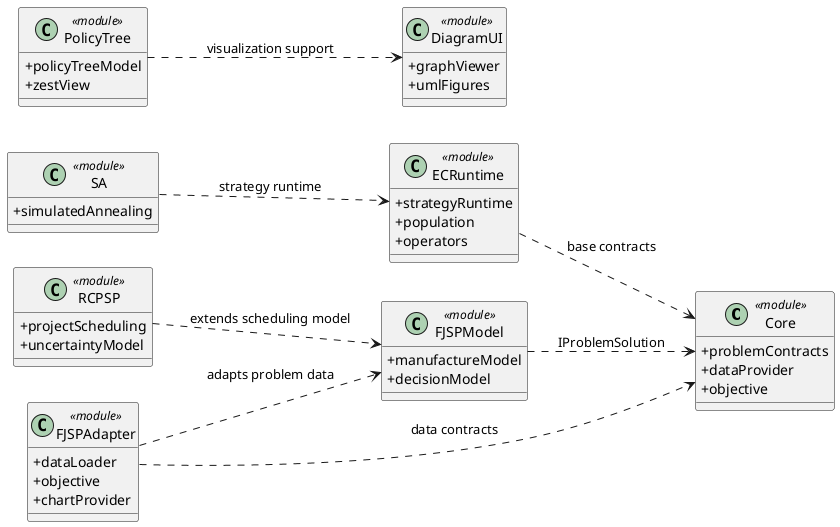
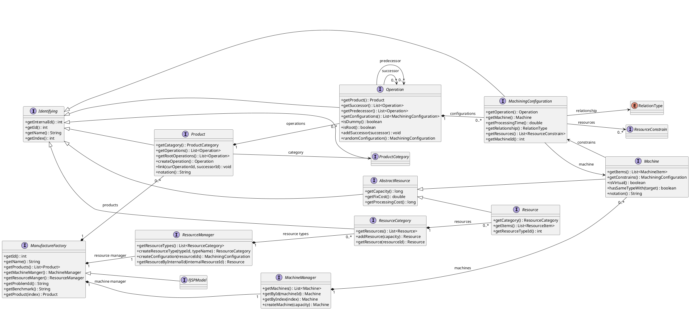
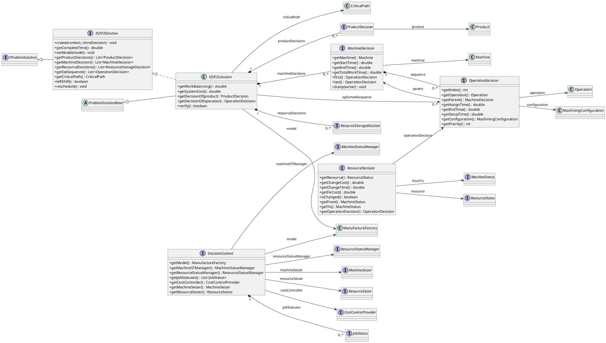
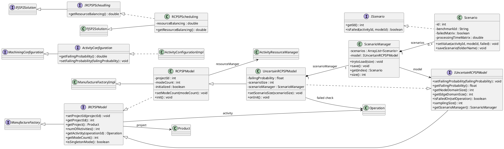
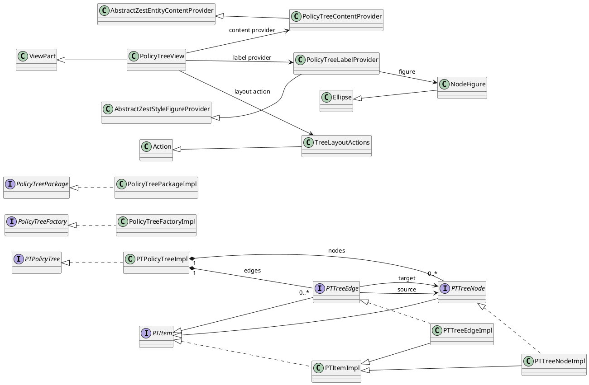

# UML 类图（Obsidian / PlantUML）

> 用法：在 Obsidian 中启用 PlantUML 插件后，直接打开本文件，或复制任一 `plantuml` 代码块到笔记中即可渲染。
>
> 说明：仓库是多模块 Java/Eclipse 插件工程，类数量较多。这里按“领域模型 -> 调度决策 -> RCPSP 扩展 -> 策略运行时 -> 工具视图”的层次做了精简类图，保留主干接口、实现类和关键聚合关系。

## 1. 全局模块关系

## 2. FJSP 领域模型

## 3. FJSP 调度决策模型

## 4. RCPSP 与不确定性扩展

## 5. SA 策略与 EC Runtime 关系

```plantuml
@startuml
left to right direction
skinparam classAttributeIconSize 0

interface IECOperation
interface IECStrategy
interface IECOptimizator
abstract class AbstractECStrategy
class SearchingStrategy
abstract class ECOptimizatorBase

interface ISAStrategy {
  +getNeighborSize() : int
  +getDefaultOptimizator() : ISAOptimizator
  +getTemperature() : double
  +getCoolingRate() : double
  +getVirtualPopsize() : int
}

class ECSAStrategy {
  -temperature : double
  -coolingRate : double
  -neighborSize : int
  -virtualPopsize : int
  -optimizator : ISAOptimizator
  +doPerform() : void
}

interface ISAOptimizator

class ECSAOptimizator {
  -temperature : double
  -coolingRate : double
  -maxIteration : int
  -iterationCount : int
  +generateNeighbour(curState) : IOffsprings
  +anneal(curState, newState, temperature) : boolean
  +doPerform() : void
}

interface ISAConfiguration
class SAConfiguration
interface ISAConfigurationLoader
class SAConfigurationLoader

IECOperation <|-- IECStrategy
IECOperation <|-- IECOptimizator
IECStrategy <|.. AbstractECStrategy
AbstractECStrategy <|-- SearchingStrategy
SearchingStrategy <|-- ECSAStrategy
IECStrategy <|-- ISAStrategy
ISAStrategy <|.. ECSAStrategy

IECOptimizator <|.. ECOptimizatorBase
ECOptimizatorBase <|-- ECSAOptimizator
IECOptimizator <|-- ISAOptimizator
ISAOptimizator <|.. ECSAOptimizator

ECSAStrategy "1" *-- "1" ISAOptimizator : optimizator
ECSAOptimizator --> ISAStrategy : strategy
ECSAOptimizator --> ISAConfiguration : configuration

ISAConfiguration <|.. SAConfiguration
ISAConfigurationLoader <|.. SAConfigurationLoader
@enduml
```

## 6. PolicyTree 工具模型与视图

