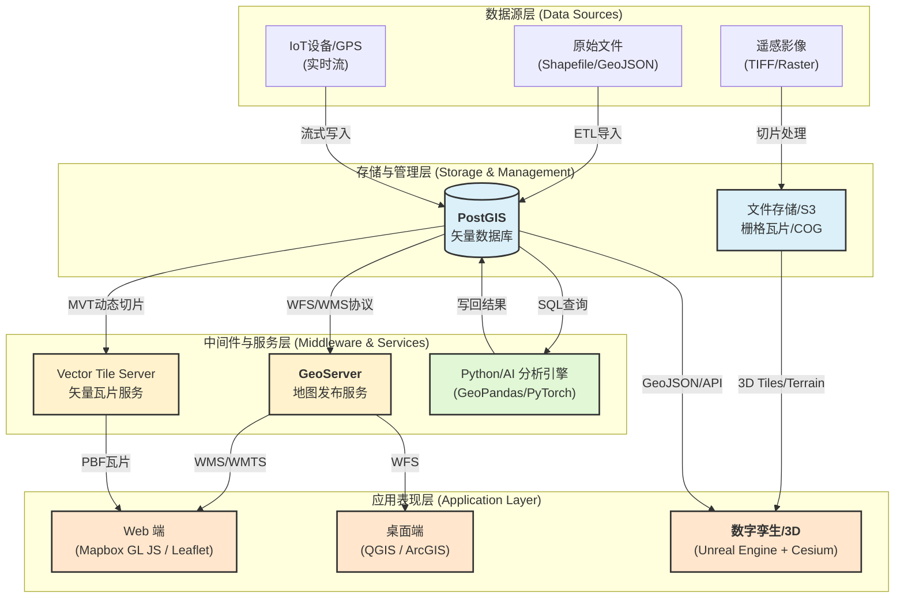

---
aliases:
tags:
description:
type:
ref-url:
create-date: 2026-04-30
---
## 内容

```mermaid
graph TD
    %% 定义样式
    classDef storage fill:#dbf0f9,stroke:#333,stroke-width:2px;
    classDef process fill:#e1f7d5,stroke:#333,stroke-width:2px;
    classDef service fill:#fff2cc,stroke:#333,stroke-width:2px;
    classDef client fill:#ffe6cc,stroke:#333,stroke-width:2px;

    %% 1. 数据源层
    subgraph Layer_Data_Source ["数据源层 (Data Sources)"]
        RawFiles["原始文件<br/>(Shapefile/GeoJSON)"]
        Satellite["遥感影像<br/>(TIFF/Raster)"]
        IoT["IoT设备/GPS<br/>(实时流)"]
    end

    %% 2. 数据存储与管理层
    subgraph Layer_Storage ["存储与管理层 (Storage & Management)"]
        PostGIS[("<b>PostGIS</b><br/>矢量数据库")]:::storage
        FileServer["文件存储/S3<br/>栅格瓦片/COG"]:::storage
    end

    %% 3. 处理与服务层 (核心)
    subgraph Layer_Service ["中间件与服务层 (Middleware & Services)"]
        direction TB
        GeoServer["<b>GeoServer</b><br/>地图发布服务"]:::service
        TileServer["Vector Tile Server<br/>矢量瓦片服务"]:::service
        AnalysisEngine["Python/AI 分析引擎<br/>(GeoPandas/PyTorch)"]:::process
    end

    %% 4. 应用表现层
    subgraph Layer_Client ["应用表现层 (Application Layer)"]
        WebClient["Web 端<br/>(Mapbox GL JS / Leaflet)"]:::client
        DesktopGIS["桌面端<br/>(QGIS / ArcGIS)"]:::client
        GameEngine["<b>数字孪生/3D</b><br/>(Unreal Engine + Cesium)"]:::client
    end

    %% 关系连线
    RawFiles -->|ETL导入| PostGIS
    Satellite -->|切片处理| FileServer
    IoT -->|流式写入| PostGIS

    PostGIS -->|SQL查询| AnalysisEngine
    PostGIS -->|WFS/WMS协议| GeoServer
    PostGIS -->|MVT动态切片| TileServer

    AnalysisEngine -->|写回结果| PostGIS

    GeoServer -->|WMS/WMTS| WebClient
    TileServer -->|PBF瓦片| WebClient
    
    FileServer -->|3D Tiles/Terrain| GameEngine
    PostGIS -->|GeoJSON/API| GameEngine
    
    GeoServer -->|WFS| DesktopGIS
```

