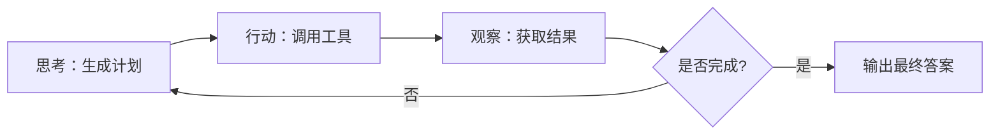

# LangGraph 概述

**LangGraph** 是由 LangChain 团队开发的一个**基于图结构构建智能体（Agent）和复杂工作流**的库，用于实现**状态化、多参与者、循环可控**的 LLM 应用。

> 💡 **一句话定义**：  
> LangGraph = **状态机 + 有向图 + LLM Agent**，让 AI 应用具备“记忆”、“规划”和“协作”能力。

---

## 一、为什么需要 LangGraph？

传统 LangChain 的 Chain 或 Agent 是**线性或简单循环**的，难以处理：

- 多步骤决策中需要**回溯或分支**
- 多个“角色”（如 Planner、Executor、Reviewer）**协作**
- 需要**显式控制循环终止条件**
- 要求**完整状态可追踪、可恢复**

✅ **LangGraph 解决这些问题**：通过**图（Graph）+ 状态（State）** 实现灵活、可控、可观察的工作流。

---

## 二、核心概念

| 概念            | 说明                                                  |
| ------------- | --------------------------------------------------- |
| **State（状态）** | 一个共享的字典，记录整个工作流的当前信息（如用户输入、中间结果、历史）                 |
| **Node（节点）**  | 工作流中的一个步骤，通常是调用 LLM、工具或函数，**接收 State，返回更新后的 State** |
| **Edge（边）**   | 定义节点之间的跳转逻辑，可以是**固定路径**或**条件路由**（由 LLM 或函数决定下一步）    |
| **Graph（图）**  | 由节点和边组成的有向图，支持**循环**（如 Agent 思考 → 行动 → 观察 → 再思考）    |

---

## 三、典型应用场景

### 1. **高级 Agent 循环**



### 2. **多角色协作**

- **Planner Node**：制定任务分解
- **Researcher Node**：检索信息
- **Writer Node**：撰写报告
- **Reviewer Node**：审核并反馈

### 3. **带人工干预的工作流**

- AI 执行 → 遇到不确定问题 → **暂停等待人类确认** → 继续执行

---

## 四、代码示例（简化版）

```python
from langgraph.graph import StateGraph, END

# 1. 定义状态
class AgentState(TypedDict):
    input: str
    steps: list
    result: str

# 2. 定义节点函数
def think(state: AgentState):
    # 调用 LLM 生成下一步行动
    return {"steps": [...], "result": ...}

def act(state: AgentState):
    # 调用工具执行
    return {"result": ...}

# 3. 构建图
workflow = StateGraph(AgentState)
workflow.add_node("think", think)
workflow.add_node("act", act)
workflow.set_entry_point("think")
workflow.add_edge("think", "act")
workflow.add_conditional_edges(
    "act",
    lambda state: "end" if is_done(state) else "think"
)
workflow.add_edge("end", END)

# 4. 编译并运行
app = workflow.compile()
result = app.invoke({"input": "写一篇关于AI的文章"})
```

---

## 五、LangGraph vs LangChain Agent

| 特性          | LangChain Agent      | LangGraph           |
| ----------- | -------------------- | ------------------- |
| **控制粒度**    | 黑盒循环（`agent.run()`）  | 白盒图结构（每个节点可见）       |
| **状态管理**    | 隐式（通过 memory）        | 显式（State 字典全程共享）    |
| **循环控制**    | 依赖 LLM 输出 stop token | 可编程条件判断（如最大步数、人工干预） |
| **多角色支持**   | 弱（单 Agent）           | 强（多个节点=多个角色）        |
| **调试与可观测性** | 较难                   | 每一步状态可记录、可视化        |

---

## 六、适用人群

- ✅ 需要构建**复杂、多步骤、可中断**的 AI 工作流
- ✅ 希望**完全掌控 Agent 决策流程**
- ✅ 要求**状态可持久化、可恢复**
- ❌ 简单问答或单次 RAG → 用 LangChain 即可，无需 LangGraph

---

> 🌟 **总结**：  
> **LangGraph 不是取代 LangChain，而是其在“复杂智能体”领域的自然演进**。  
> 当你的应用需要“像人一样思考、规划、协作”时，LangGraph 是目前最强大的开源选择。