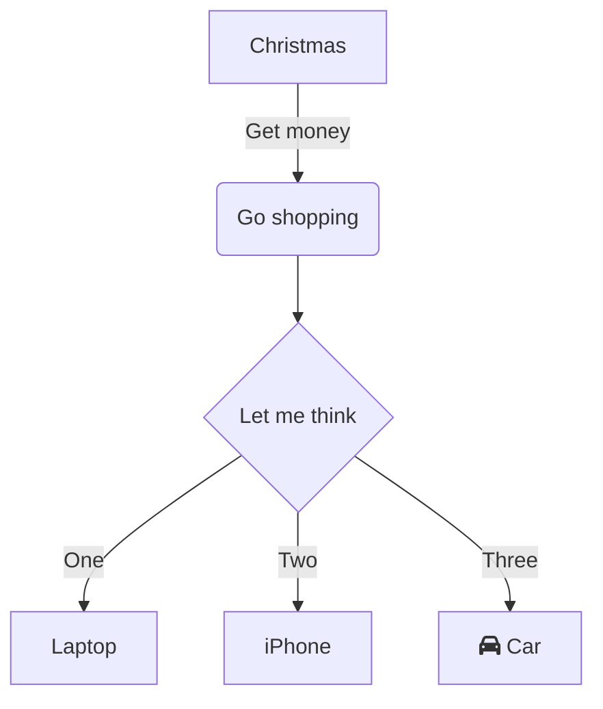
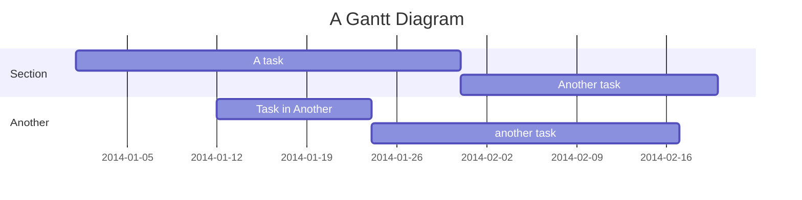

[[446eaa35b3bbc8ecf0f535226376d2bf_MD5.jpg|Open: Pasted image 20251030210443.png]]
![[446eaa35b3bbc8ecf0f535226376d2bf_MD5.jpg]]
flowchart TD

 ```  mermaid
flowchart TD
    A@{ shape: circle, label: "开始" } --> C{循环套件}
    C -->|是| D[循环体]
    C -->|否| E@{ shape: dbl-circ, label: "结束" }
    D --> |继续| C
 ```

---
### 流程图



## ganntchart


