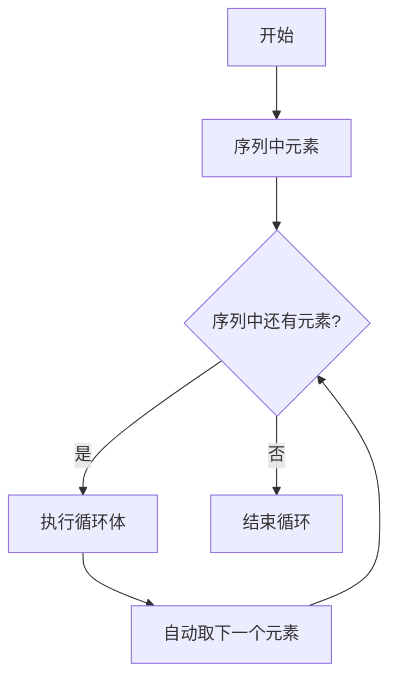

#  Python `for` 循环

- 自动化重复操作的核心工具
---

## 一、为什么需要 `for` 循环？

**核心问题**：如何高效处理「重复操作」？
- 手动重复的痛点：
	- 处理 100 张图片加水印 → 手动操作 100 次？
	- 生成 60 帧动画 → 写 60 次相似代码？
	- 统计 30 天数据 → 复制粘贴 30 次？
**for 循环的作用**：
	→ 用一行代码控制「重复执行同一套操作」
	→ 自动遍历序列中的每个元素
	→ 减少重复代码，避免人为错误
	
---
## 二、`for` 循环的核心逻辑

**类比场景**：
「分发试卷」—— 对全班每个同学（序列），都做「发一张试卷」（重复操作）
**代码逻辑**：

```python
同学列表 = ["小明", "小红", "小刚"]

for 同学 in 同学列表:
    发试卷给(同学)  # 重复操作
```

>  📌 **一句话总结**
> `for 变量 in 序列: 重复做的事`
---

## 三、基本语法

```python
for 循环变量 in 序列:
    循环体操作1  # ← 必须缩进（4个空格）
    循环体操作2
    ...
```
- **循环变量**：每次循环时，代表序列中的「当前元素」（可自定义命名）
- **序列**：待遍历的元素集合（如列表、数字范围、文件列表等）
- **循环体**：缩进的代码块（Python 用缩进来区分循环内的操作）

> ⚠️ **注意**：Python 用缩进来区分代码块，**缩进错误会报错！**

---


---
## 四、常用序列类型 

| 序列类型                        | 示例（数媒场景）       | 代码写法                            |
| --------------------------- | -------------- | ------------------------------- |
| [[py-列表(List)\|列表]]         | 批量处理的图片路径      | `["img1.jpg", "img2.png", ...]` |
| `range`                     | 动画帧编号（0 到 299） | `range(300)` → 0,1,2,...,299    |
| [[py-字符串类型(str)\|字符串(str)]] | 解析文件名          | `"frame_001.png"`               |

---

## 五、实战示例

### 示例 1：遍历列表 
```python
image_paths = ["pic1.jpg", "pic2.jpg", "pic3.jpg"]

for path in image_paths:
    print(f"正在处理：{path}")
    # 可添加实际操作：如缩放、加水印等
```
### 示例 2：使用 `range`（生成动画帧）
```python
for frame in range(5):  # 生成 0 到 4 共 5 帧
    print(f"生成第{frame}帧动画")
    # 实际应用：计算该帧的物体位置、颜色等
```


> [!hint] **课堂练习**
> ![[实践-逐帧动画处理#题目]]
>  **提交连接** : https://3willartlab.feishu.cn/share/base/form/shrcnVfFKpBTHch1gz6OvThX0Kb 
---

## 六、要点总结

| 要点       | 说明                    |
| -------- | --------------------- |
| **核心功能** | 自动化重复操作，遍历序列          |
| **语法规则** | `for 变量 in 序列: 缩进的操作` |
| **循环变量** | 依次取序列中的每个值            |
| **缩进要求** | 循环体必须缩进（推荐 4 个空格）     |
| **循环次数** | 由序列长度决定               |
>  **for应用场景**:  数量已知的重复操作
