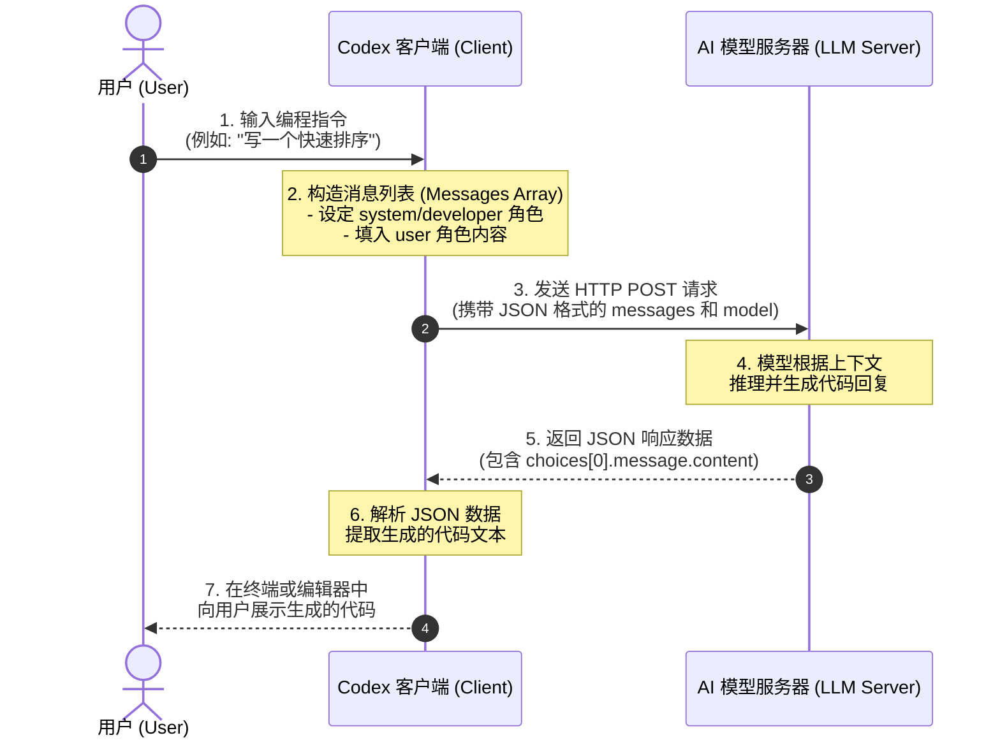

```mermaid
sequenceDiagram
    autonumber
    actor User as 用户 (User)
    participant Codex as Codex 客户端 (Client)
    participant API as AI 模型服务器 (LLM Server)

    User->>Codex: 1. 输入编程指令<br/>(例如: "写一个快速排序")
    
    Note over Codex: 2. 构造消息列表 (Messages Array)<br/>- 设定 system/developer 角色<br/>- 填入 user 角色内容
    
    Codex->>API: 3. 发送 HTTP POST 请求<br/>(携带 JSON 格式的 messages 和 model)
    
    Note over API: 4. 模型根据上下文<br/>推理并生成代码回复
    
    API-->>Codex: 5. 返回 JSON 响应数据<br/>(包含 choices[0].message.content)
    
    Note over Codex: 6. 解析 JSON 数据<br/>提取生成的代码文本
    
    Codex-->>User: 7. 在终端或编辑器中<br/>向用户展示生成的代码

```
