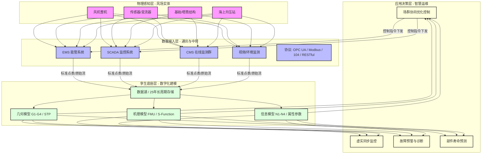

- 数字孪生
	- **构成**
		- 应用层
		- 孪生层
			- 孪生体(虚拟实体)
				- [[标准点表]]
		- 控制层
			- 功能
				- 负责直接从 L1 层采集高频实时数据（如功率、转速、油温），并将上层的控制指令下发给风机。
			- 组件
				- SCADA
					- 实时映像的“`供给者`” (Input)
						- **关键指标：** 采样频率（秒级）、数据同步性、点表覆盖度。
					- 闭环控制的“`执行器`” (Output)
						- 关键指标：指令时延（< 2秒）、链路安全性。
		- 物理层(感知层)
			- 风机硬件、传感器、变流器、CMS 在线监测设备。
## 流向

| **维度** | **流向：从 SCADA 到 数字孪生**    | **流向：从 数字孪生 到 SCADA**   |
| ------ | ------------------------ | ----------------------- |
| **内容** | 实时运行参数、故障告警、气象数据         | 优化设定值（有功/无功）、维护预警建议     |
| **目的** | 驱动虚拟仿真，更新部件疲劳状态          | 实现场群优化控制，预防性停机          |
| **协议** | OPC DA/UA, IEC 104, MQTT | Modbus TCP, API/RESTful |

