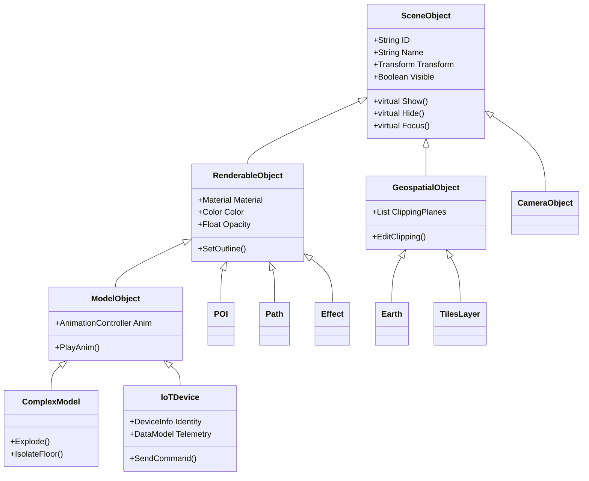

---
aliases:
  - zs/平台/规划/交互设计/内容/交互对象类图
tags:
description:
type:
ref-url:
create-date: 2026-04-29
---
## 内容

```mermaid
classDiagram
    class SceneObject {
        +String ID
        +String Name
        +Transform Transform
        +Boolean Visible
        +virtual Show()
        +virtual Hide()
        +virtual Focus()
    }

    class RenderableObject {
        +Material Material
        +Color Color
        +Float Opacity
        +SetOutline()
    }

    class GeospatialObject {
        +List ClippingPlanes
        +EditClipping()
    }

    class IoTDevice {
        +DeviceInfo Identity
        +DataModel Telemetry
        +SendCommand()
    }

    class ModelObject {
        +AnimationController Anim
        +PlayAnim()
    }

    class ComplexModel {
        +Explode()
        +IsolateFloor()
    }

    SceneObject <|-- RenderableObject
    SceneObject <|-- GeospatialObject
    SceneObject <|-- CameraObject
    
    GeospatialObject <|-- Earth
    GeospatialObject <|-- TilesLayer
    
    RenderableObject <|-- ModelObject
    RenderableObject <|-- POI
    RenderableObject <|-- Path
    RenderableObject <|-- Effect
    
    ModelObject <|-- ComplexModel
    ModelObject <|-- IoTDevice
```
