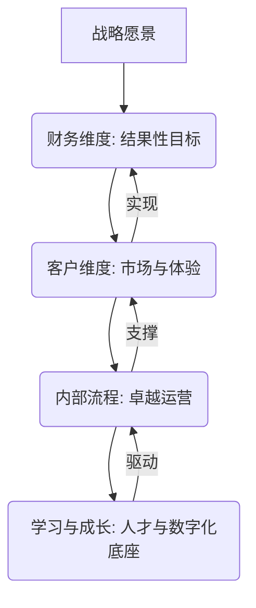

---
aliases:
  - 维度思考逻辑
---

## 逻辑
- 从内到外
- 从过程到结果
- 从客观到主观

```mermaid
graph TD
    A[战略愿景] --> B(财务维度: 结果性目标)
    B --> C(客户维度: 市场与体验)
    C --> D(内部流程: 卓越运营)
    D --> E(学习与成长: 人才与数字化底座)
    E --> |驱动| D
    D --> |支撑| C
    C --> |实现| B
```