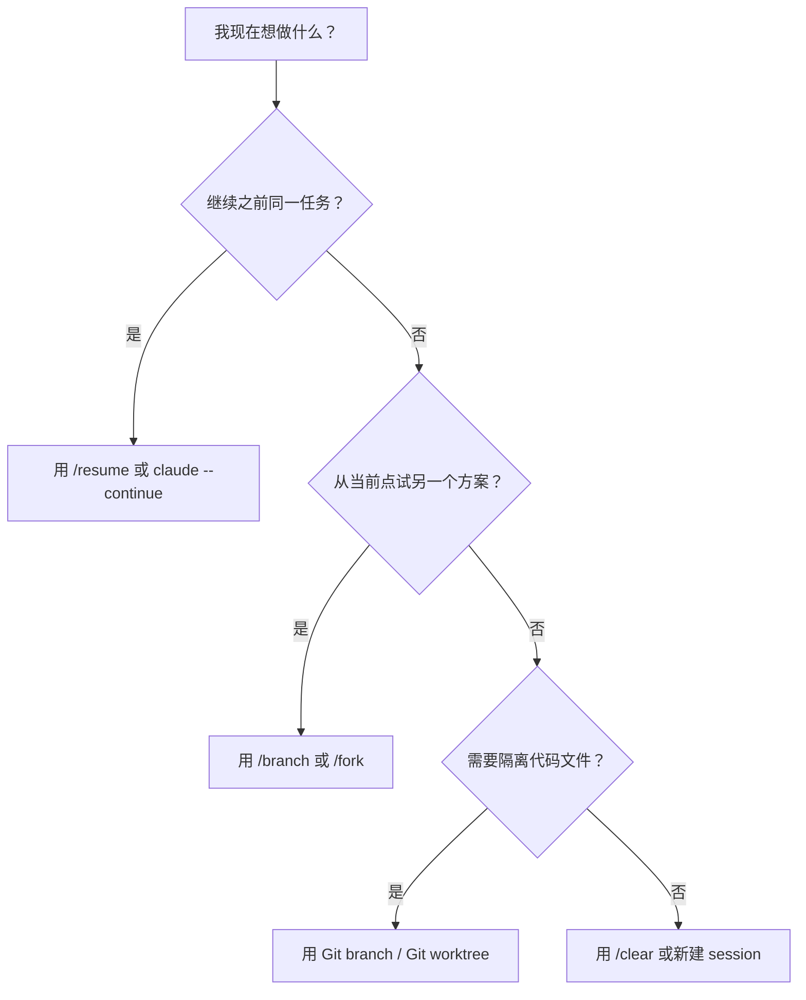

# Claude Code 会话与分支

> [!summary]
> **会话(Session)** 是一条可恢复的任务线；**分支(Branch/Fork)** 是从某条任务线的某个时间点派生出的新任务线。它分叉的是对话历史与上下文路径，不等于 Git branch。

## 1. 概念界定

- **会话(Session)**：Claude Code 中一条独立的对话任务线。它保存消息历史、工具调用结果、上下文状态、会话 ID、会话名称等。可以通过 `/resume`、`claude --resume`、`claude --continue` 恢复。
- **分支(Branch/Fork)**：从当前会话的某个时间点复制出一条新的对话路径。原会话保留，新分支成为新的独立会话，可以继续探索另一个方案。Claude Code 中 `/branch` 也可写作 `/fork`。
- **Git 分支(Git Branch)**：Git 版本控制中的代码历史分支，用来隔离文件修改和提交历史。它和 Claude Code 的会话分支不是同一件事。

核心关系：

```text
Session = 一条任务线
Branch/Fork = 从任务线某个节点分出的另一条任务线
Git Branch = 代码版本历史中的另一条线
```

## 2. 边界辨析

| 维度       | 会话(Session)                                     | 分支(Branch/Fork)          | Git 分支(Git Branch)                       |
| -------- | ----------------------------------------------- | ------------------------ | ---------------------------------------- |
| 分叉对象     | 对话任务线                                           | 对话历史与上下文路径               | 代码提交历史                                   |
| 核心作用     | 保存、恢复、继续某个任务                                    | 试另一种方案，同时保留原会话           | 隔离代码修改与版本演进                              |
| 是否有独立 ID | 有                                               | 有，分支后形成新 session         | 有分支名                                     |
| 是否保留原路径  | 是                                               | 是，原会话不被覆盖                | 是，原 Git 分支不被覆盖                           |
| 是否隔离文件系统 | 不必然                                             | 不必然                      | 通常配合 checkout/worktree 实现隔离              |
| 常用命令     | `/resume`、`claude --resume`、`claude --continue` | `/branch [name]`、`/fork` | `git branch`、`git switch`、`git worktree` |
| 常见误用     | 把 session 当成一次性聊天                               | 把 branch 当成 Git branch   | 以为 Git branch 会保留 Claude 上下文             |


## 3. 最关键差异

Claude Code 的 `branch/fork` 分叉的是：

```text
对话历史
任务思路
上下文路径
Claude 已经获得的信息与推理链路
```

它不自动分叉：

```text
当前工作目录
真实文件系统
Git 提交历史
依赖环境
数据库或外部系统状态
```

因此，在同一个工作目录下，两个 Claude Code 会话或会话分支如果都修改同一个文件，仍然可能互相影响。要做文件级隔离，应使用 Git branch、Git worktree，或 Claude Code Desktop / worktree 模式提供的隔离能力。

## 4. 类比解释

### 类比一：写论文

会话像一份论文草稿；分支像你在第三章处复制了一份草稿，用来尝试另一种论证路线。

这个类比的限制是：论文副本天然复制文件本身，而 Claude Code 的 branch 主要复制对话历史，不一定复制工作目录里的真实文件。

### 类比二：Git 思维

会话像一条正在推进的思路历史；分支像从某个节点分出一条新思路，继续尝试另一个解法。

这个类比的限制是：Claude Code branch 不是 Git branch。它不能天然替代 Git 的文件隔离、提交历史和合并能力。

## 5. 应用指南

- **继续原任务**：用 `/resume` 或 `claude --continue`。
- **找回某个历史任务**：用 `/resume` 打开会话选择器。
- **从当前点试另一条方案**：用 `/branch 新方案名`。
- **怕新方案污染原思路**：用 `/branch`，不要在原会话里反复改口。
- **怕新方案污染代码文件**：用 Git branch 或 Git worktree，不要只依赖 Claude Code branch。
- **上下文太长但仍在同一任务中**：用 `/compact`，不是 `/branch`。
- **彻底换一个任务**：用 `/clear` 或新建 session。

## 6. 判断流程



## 7. 常见误区

1. **误区：Claude Code branch 就是 Git branch。**  
   不是。它主要是对话分支，不是代码版本分支。

2. **误区：开了 branch，文件修改天然隔离。**  
   不一定。CLI/SDK 语境下，fork 主要分叉会话历史；如果在同一目录编辑文件，文件变化仍然是真实发生的。

3. **误区：Git branch 会自动带上 Claude 的上下文。**  
   不会。Git 负责代码历史，Claude session 负责对话上下文，两者是不同系统。

4. **误区：上下文太长就应该 branch。**  
   不一定。上下文太长但任务没变，优先用 `/compact`；只有要探索另一条路径时才用 `/branch`。

## 压缩记忆

> `Session` 管一条可恢复的 Claude 任务线；`Branch/Fork` 从这条任务线分出另一条对话路径；`Git branch` 才负责代码版本隔离。不要用 Claude Code branch 替代 Git branch。
