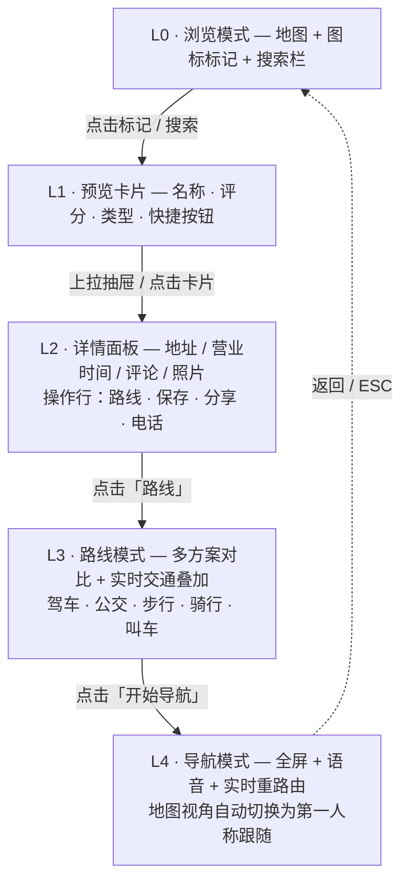
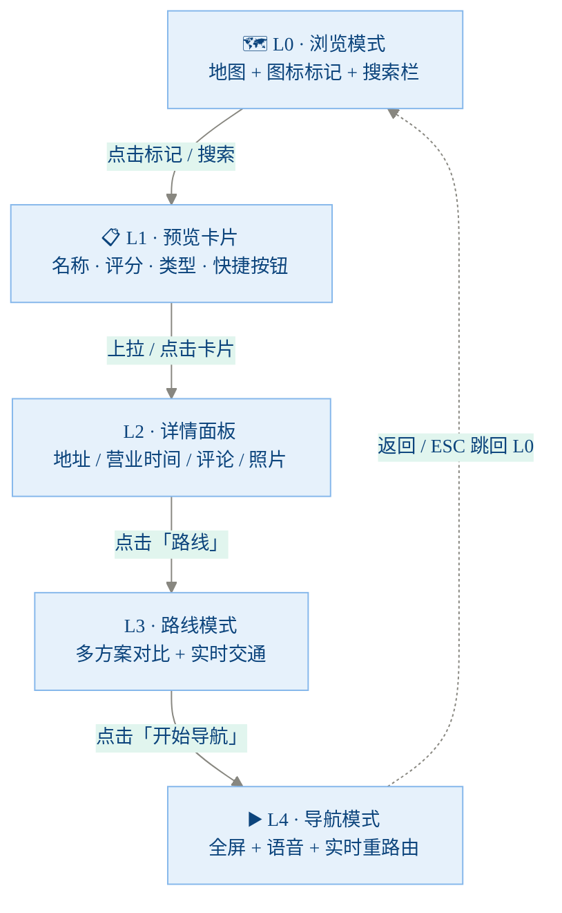
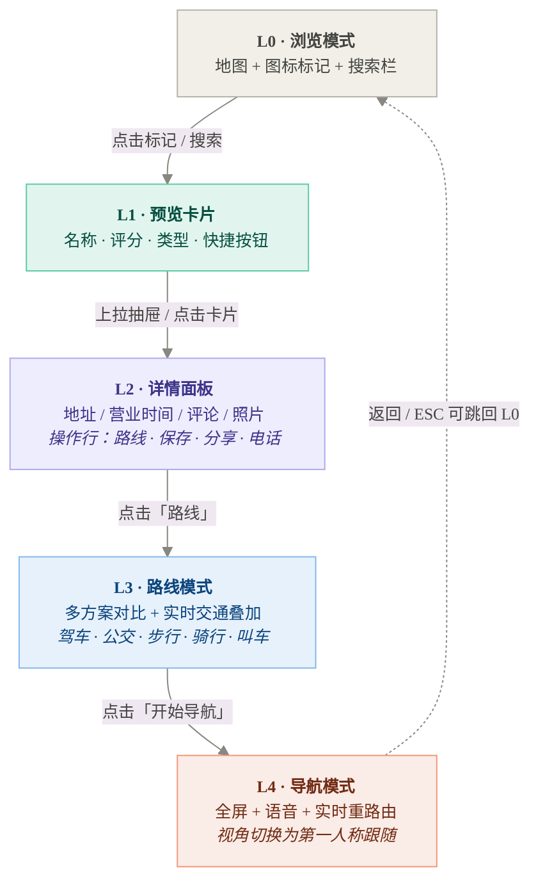
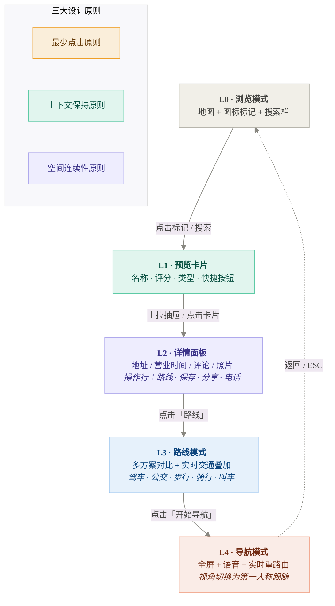

# 渐进式信息披露 — Mermaid 版 vs SVG 版对比

> 用于评估 Mermaid 在 Obsidian 中能否替代内联 SVG

---

## 方案 A：Mermaid 基础版 (零配置)

---

## 方案 B：Mermaid 自定义主题色版

---

## 方案 C：Mermaid 分色 + classDef 版 (最接近 SVG 效果)

---

## 方案 C+：增加底部原则标注

---

## 对比参照：原始内联 SVG 版

<svg width="100%" viewBox="0 0 680 480" xmlns="http://www.w3.org/2000/svg">
  <defs>
    <marker id="arrowD" viewBox="0 0 10 10" refX="8" refY="5" markerWidth="6" markerHeight="6" orient="auto-start-reverse">
      <path d="M2 1L8 5L2 9" fill="none" stroke="#888" stroke-width="1.5" stroke-linecap="round"/>
    </marker>
    <marker id="arrowBack" viewBox="0 0 10 10" refX="8" refY="5" markerWidth="6" markerHeight="6" orient="auto-start-reverse">
      <path d="M2 1L8 5L2 9" fill="none" stroke="#B4B2A9" stroke-width="1.5" stroke-linecap="round"/>
    </marker>
  </defs>

  <text x="340" y="24" text-anchor="middle" font-family="sans-serif" font-size="14" font-weight="600" fill="#444">渐进式信息披露 — 5 层模型</text>

  <text x="60" y="60" text-anchor="end" font-family="sans-serif" font-size="11" font-weight="500" fill="#999">L0</text>
  <rect x="80" y="44" width="500" height="40" rx="8" fill="#F1EFE8" stroke="#B4B2A9" stroke-width="0.5"/>
  <text x="330" y="68" text-anchor="middle" font-family="sans-serif" font-size="14" font-weight="600" fill="#444441">浏览模式 — 地图 + 图标标记 + 搜索栏</text>

  <line x1="330" y1="84" x2="330" y2="108" stroke="#888" stroke-width="0.8" marker-end="url(#arrowD)"/>
  <text x="344" y="100" text-anchor="start" font-family="sans-serif" font-size="12" fill="#666">点击标记 / 搜索</text>

  <text x="60" y="134" text-anchor="end" font-family="sans-serif" font-size="11" font-weight="500" fill="#999">L1</text>
  <rect x="80" y="118" width="500" height="40" rx="8" fill="#E1F5EE" stroke="#5DCAA5" stroke-width="0.5"/>
  <text x="330" y="142" text-anchor="middle" font-family="sans-serif" font-size="14" font-weight="600" fill="#085041">预览卡片 — 名称 · 评分 · 类型 · 快捷按钮</text>

  <line x1="330" y1="158" x2="330" y2="182" stroke="#888" stroke-width="0.8" marker-end="url(#arrowD)"/>
  <text x="344" y="174" text-anchor="start" font-family="sans-serif" font-size="12" fill="#666">上拉抽屉 / 点击卡片</text>

  <text x="60" y="210" text-anchor="end" font-family="sans-serif" font-size="11" font-weight="500" fill="#999">L2</text>
  <rect x="80" y="192" width="500" height="52" rx="8" fill="#EEEDFE" stroke="#AFA9EC" stroke-width="0.5"/>
  <text x="330" y="214" text-anchor="middle" font-family="sans-serif" font-size="14" font-weight="600" fill="#3C3489">详情面板 — 地址 / 营业时间 / 评论 / 照片</text>
  <text x="330" y="232" text-anchor="middle" font-family="sans-serif" font-size="12" fill="#534AB7">操作行：路线 · 保存 · 分享 · 电话</text>

  <line x1="330" y1="244" x2="330" y2="268" stroke="#888" stroke-width="0.8" marker-end="url(#arrowD)"/>
  <text x="344" y="260" text-anchor="start" font-family="sans-serif" font-size="12" fill="#666">点击「路线」</text>

  <text x="60" y="290" text-anchor="end" font-family="sans-serif" font-size="11" font-weight="500" fill="#999">L3</text>
  <rect x="80" y="274" width="500" height="52" rx="8" fill="#E6F1FB" stroke="#85B7EB" stroke-width="0.5"/>
  <text x="330" y="296" text-anchor="middle" font-family="sans-serif" font-size="14" font-weight="600" fill="#0C447C">路线模式 — 多方案对比 + 实时交通叠加</text>
  <text x="330" y="314" text-anchor="middle" font-family="sans-serif" font-size="12" fill="#185FA5">驾车 · 公交 · 步行 · 骑行 · 叫车</text>

  <line x1="330" y1="326" x2="330" y2="350" stroke="#888" stroke-width="0.8" marker-end="url(#arrowD)"/>
  <text x="344" y="342" text-anchor="start" font-family="sans-serif" font-size="12" fill="#666">点击「开始导航」</text>

  <text x="60" y="376" text-anchor="end" font-family="sans-serif" font-size="11" font-weight="500" fill="#999">L4</text>
  <rect x="80" y="358" width="500" height="52" rx="8" fill="#FAECE7" stroke="#F0997B" stroke-width="0.5"/>
  <text x="330" y="380" text-anchor="middle" font-family="sans-serif" font-size="14" font-weight="600" fill="#712B13">导航模式 — 全屏 + 语音 + 实时重路由</text>
  <text x="330" y="398" text-anchor="middle" font-family="sans-serif" font-size="12" fill="#993C1D">地图视角自动切换为第一人称跟随</text>

  <path d="M70 380 C40 380, 40 64, 70 64" fill="none" stroke="#B4B2A9" stroke-width="0.5" stroke-dasharray="4 2" marker-end="url(#arrowBack)"/>
  <text x="28" y="225" text-anchor="middle" font-family="sans-serif" font-size="11" fill="#999" transform="rotate(-90, 28, 225)">返回 / ESC 可跳回 L0</text>

  <rect x="100" y="434" width="150" height="30" rx="6" fill="#FAEEDA" stroke="#EF9F27" stroke-width="0.5"/>
  <text x="175" y="453" text-anchor="middle" font-family="sans-serif" font-size="12" font-weight="500" fill="#633806">最少点击原则</text>

  <rect x="270" y="434" width="150" height="30" rx="6" fill="#E1F5EE" stroke="#5DCAA5" stroke-width="0.5"/>
  <text x="345" y="453" text-anchor="middle" font-family="sans-serif" font-size="12" font-weight="500" fill="#085041">上下文保持原则</text>

  <rect x="440" y="434" width="150" height="30" rx="6" fill="#EEEDFE" stroke="#AFA9EC" stroke-width="0.5"/>
  <text x="515" y="453" text-anchor="middle" font-family="sans-serif" font-size="12" font-weight="500" fill="#3C3489">空间连续性原则</text>
</svg>

---

## 评估总结

| 维度 | Mermaid A (零配置) | Mermaid B (主题色) | Mermaid C (classDef) | 内联 SVG |
|------|------------------|------------------|---------------------|---------|
| **色彩精确** | ❌ 默认灰蓝 | ⚠️ 只能改全局主色 | ✅ 每节点独立色 | ✅ 像素级 |
| **布局控制** | ❌ 自动排列 | ❌ 自动排列 | ❌ 自动排列 | ✅ 手动精确 |
| **标题/副标题分层** | ❌ 单一文本色 | ❌ 单一文本色 | ⚠️ 用 `<b>` / `<i>` 近似 | ✅ 双色双字重 |
| **左侧层级标注** | ❌ 无法实现 | ❌ 无法实现 | ❌ 无法实现 | ✅ 自由定位 |
| **返回箭头弧线** | ⚠️ 虚线直连 | ⚠️ 虚线直连 | ⚠️ 虚线直连 | ✅ 贝塞尔弧线 |
| **底部原则标注** | ❌ 不支持 | ❌ 不支持 | ⚠️ subgraph 近似 | ✅ 自由布局 |
| **宽度占满** | ❌ 节点窄 | ❌ 节点窄 | ❌ 节点窄 | ✅ 500px 横通 |
| **可维护性** | ✅ 文本改一行 | ✅ 文本改一行 | ✅ 文本改一行 | ❌ 改坐标 |
| **暗色模式** | ✅ 自动 | ⚠️ 部分 | ⚠️ 硬编码色 | ❌ 硬编码色 |
| **团队可读性** | ✅ 一目了然 | ✅ 一目了然 | ⚠️ classDef 略复杂 | ❌ 坐标噪音 |

### 结论

**Mermaid C (classDef 分色版)** 是最接近 SVG 效果的 Mermaid 方案，但仍存在明显差距：

1. **无法控制节点宽度** — Mermaid 自动适配文本宽度，做不到 SVG 的「500px 横通栏」效果
2. **无法添加自由定位元素** — 左侧的 L0-L4 层级标注、底部的原则标注块无法用 Mermaid 表达
3. **标题/副标题无法双色分层** — 只能用 `<b>` / `<i>` 模拟，但颜色是统一的
4. **返回箭头只能直连** — 无法画左侧的弧形返回路径

**建议**：这张「渐进式披露」图属于**信息密度高 + 色彩语义丰富 + 布局有特殊需求**的图表，应该保留 SVG 或转为 Excalidraw。Mermaid 更适合简单的线性流程图。
